# Leetcode刷题

### 整数反转

https://leetcode.cn/problems/reverse-integer/description/?envType=featured-list&envId=2cktkvj%3FenvType%3Dfeatured-list&envId=2cktkvj

> 反转一个整数：只需要拿到这个整数的**末尾数字**即可，以12345为例，先拿到5，再拿到4，之后是3、2、1，我们按顺序取出末尾数字就可以反向拼接出一个数，以达到反转的效果。

如何拿末尾数字——取模运算！！！


本题的难点在于判断是否**溢出**，因为题目中明确表达过：

> 假设我们的环境只能存储得下 32 位的有符号整数，则其数值范围为 `[−2^31, 2^31 − 1]`。

因此需要提前判断是否溢出，最大的32位整数为pow(2,31)-1 = 2147483647。因此，当到达**最大整数的1/10**时就要开始判断了

- 如果某个数字大于 214748364，那后面就不用再判断了，肯定溢出了。

- 如果某个数字等于 214748364，那么需要要跟最大数的末尾数字比较，如果这个数字比7还大，说明溢出了。

> 注意：其实这里不需要判断第二种情况，因为不可能出现2147483648、2147483649这两种数字，如果出现则说明原始输入就产生了溢出，而这显然不可能，因此只需考虑第一种情况

```c#
class Solution {
public:
   int reverse(int x) {
       int ans = 0;
       while (x != 0) {
           if (ans > 214748364 || ans < -214748364) return 0;
           int temp = x % 10;
           ans = 10 * ans + temp;
           x /= 10;
       }
       return ans;
   }
};
```


### 判断回文数

https://leetcode.cn/problems/palindrome-number/solutions/281686/hui-wen-shu-by-leetcode-solution/?envType=featured-list&envId=2cktkvj%3FenvType%3Dfeatured-list&envId=2cktkvj

> 思想：将数字本身反转，然后将反转后的数字与原始数字进行比较。如果它们是相同的，那么这个数字就是回文。

需要注意的是，反转整个数可能会产生整数溢出问题，因此需要判断溢出。当反转后的数溢出时，说明它一定不是回文数，因为回文数反转后是它本身，所以一定不会溢出。

```c#
class Solution {
public:
    bool isPalindrome(int x) {
        if(x<0){
            return false;
        }
        int temp=0;
        int sum=0;
        int y=x;
        while(x!=0){
            temp=x%10;
            if(sum>214748364||sum<-214748364){
                return false;
            }
            sum=sum*10+temp;
            x/=10;
        }
        if(sum==y){
            return true;
        }
        return false;
    }
};
```


### 盛最多水的容器（双指针）

https://leetcode.cn/problems/container-with-most-water/?envType=featured-list&envId=2cktkvj%3FenvType%3Dfeatured-list&envId=2cktkvj

> 本题需要使用双指针的解法。
>
> 设两指针i、j指向的水槽板高度分别为h[i]、h[j]，此状态下容器的盛水体积为V(i,j)。由于可容纳水的高度由短板决定，因此可得如下体积公式：

$$
V(i,j)=min(h[i],h[j])×(j-i)
$$

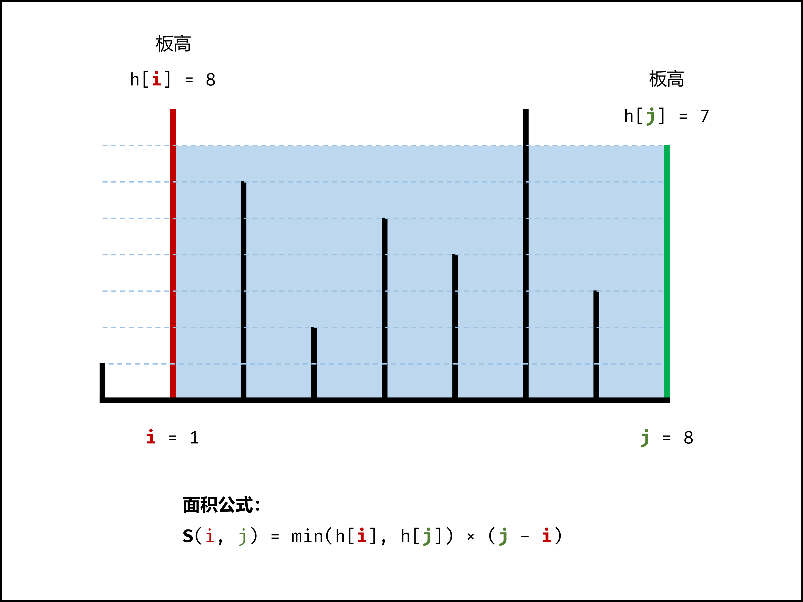

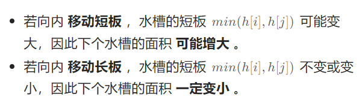

因此，双指针初始时分别位于水槽的左右两端，每轮循环将短板向内移动一格，并更新面积的最大值，直到两指针相遇时跳出即可。

**算法流程：**

1. 初始化：双指针i、j分列水槽左右两侧
2. 循环收窄：直至双指针相遇时跳出
   - 更新面积最大值res
   - 选定两板中高度短的短板，向内收窄一格
3. 返回值：返回面积最大值res即可

```c#
class Solution {
public:
    int maxArea(vector<int>& height) {
        int res=0;
        int i=0, j=height.size()-1;
        while(i<j){
            if(height[i] < height[j]){
                res=max(res,height[i]*(j-i));
                i++;
            }else{
                res=max(res,height[j]*(j-i));
                j--;
            }
        }
        return res;
    }
};
```


### 整数转罗马数字

https://leetcode.cn/problems/integer-to-roman/?envType=featured-list&envId=2cktkvj%3FenvType%3Dfeatured-list&envId=2cktkvj

将整数（1≤num≤3999）转为罗马数字，规则如下：

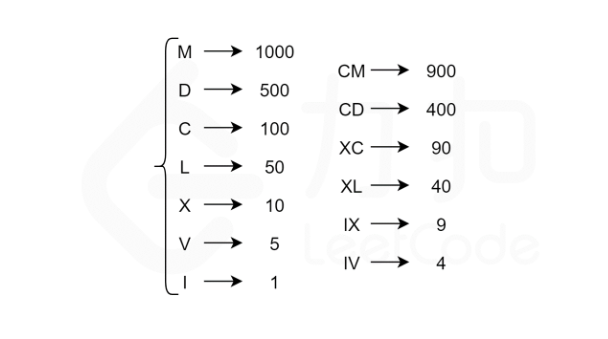

> 使用硬编码方式：
>
> - 千位数只能由M表示
> - 百位数只能由C、CD、D、CM表示
> - 十位数只能由X、XL、L、XC表示
> - 个位数只能由I、IV、V、IX表示

进一步地，我们可以计算出每个数字在每个位上的表示形式，整理成一张硬编码表，如下图所示：


利用取模运算和除法运算，可以得到num每个位上的数字

```
thousands_digit = num / 1000
hundreds_digit = (num % 1000) / 100
tens_digit = (num % 100) / 10
ones_digit = num % 10
```

最后，根据num每个位上的数字，在硬编码表中查找对应的罗马字符，并将结果拼接在一起，即为num对应的罗马数字

```c#
const string thousands[] = {"", "M", "MM", "MMM"};
const string hundreds[]  = {"", "C", "CC", "CCC", "CD", "D", "DC", "DCC", "DCCC", "CM"};
const string tens[]      = {"", "X", "XX", "XXX", "XL", "L", "LX", "LXX", "LXXX", "XC"};
const string ones[]      = {"", "I", "II", "III", "IV", "V", "VI", "VII", "VIII", "IX"};

class Solution {
public:
    string intToRoman(int num) {
        return thousands[num / 1000] + hundreds[num % 1000 / 100] + tens[num % 100 / 10] + ones[num % 10];
    }
};
```


### 罗马数字转整数

https://leetcode.cn/problems/roman-to-integer/?envType=featured-list&envId=2cktkvj%3FenvType%3Dfeatured-list&envId=2cktkvj

直接if-else

```c#
class Solution {
public:
    int romanToInt(string s) {
        int res=0;int i=0;
         while(i < s.size()) {
            if (s[i] == 'M') {
                res += 1000;
                i++;
            } else if (s[i] == 'C' && s[i+1] == 'M') {
                res += 900;
                i += 2;
            } else if (s[i] == 'D') {
                res += 500;
                i++;
            } else if (s[i] == 'C' && s[i+1] == 'D') {
                res += 400;
                i += 2;
            } else if (s[i] == 'C') {
                res += 100;
                i++;
            } else if (s[i] == 'X' && s[i+1] == 'C') {
                res += 90;
                i += 2;
            } else if (s[i] == 'L') {
                res += 50;
                i++;
            } else if (s[i] == 'X' && s[i+1] == 'L') {
                res += 40;
                i += 2;
            } else if (s[i] == 'X') {
                res += 10;
                i++;
            } else if (s[i] == 'I' && s[i+1] == 'X') {
                res += 9;
                i += 2;
            } else if (s[i] == 'V') {
                res += 5;
                i++;
            } else if (s[i] == 'I' && s[i+1] == 'V') {
                res += 4;
                i += 2;
            } else if (s[i] == 'I') {
                res += 1;
                i++;
            } 
        }
  return res;
    }
};
```


### 最长公共前缀

https://leetcode.cn/problems/longest-common-prefix/description/?envType=featured-list&envId=2cktkvj%3FenvType%3Dfeatured-list&envId=2cktkvj

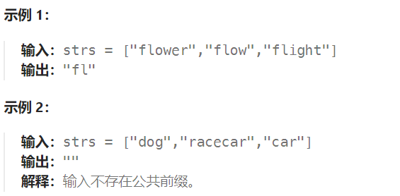

思路如下：

- 当字符串数组长度为 0 时则公共前缀为空，直接返回；

- 令最长公共前缀 ans 的值为第一个字符串，进行初始化；
- 遍历后面的字符串，依次将其与 ans 进行比较，**两两找出公共前缀**，最终结果即为最长公共前缀；
- 如果查找过程中出现了 ans 为空的情况，则公共前缀不存在直接返回；

```c#
class Solution {
public:
    string longestCommonPrefix(vector<string>& strs) {
        string ans=strs[0];
        for(int i=1;i<strs.size();i++){
            int j;
            for(j=0;j<ans.size()&&j<strs[i].size();j++){
                if(ans[j]!=strs[i][j]){
                    break;
                }
            }
            ans=ans.substr(0,j);
            if(ans==""){
                return "";
            }
        }
        return ans;
    }
};
```


### 三数之和（排序+双指针）

https://leetcode.cn/problems/3sum/description/?envType=featured-list&envId=2cktkvj%3FenvType%3Dfeatured-list&envId=2cktkvj

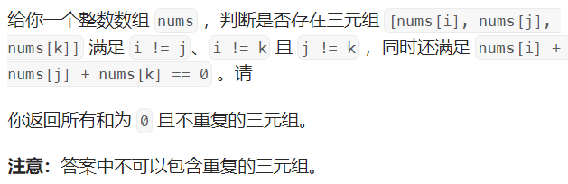

**算法流程：**

1. 先将数组nums排序，时间复杂度为O(nlogn)
2. 固定三个指针中最左元素的指针k，双指针i、j分别设在数组索引（k，nums.size()）两端
3. 双指针交替向中间移动，记录对于每个固定指针k的所有满足nums[k]+nums[i]+nums[j]=0的（i,j）组合
   - 当nums[k]>0时直接break跳出，因为三个元素均大于0，其和不可能为0
   - 当k>0且nums[k]==nums[k-1]时，跳过此元素（去重）
   - 当i<j时循环计算s=nums[k]+nums[i]+nums[j]，并按照以下规则执行双指针移动：
     - 当s<0时，i++并跳过所有重复的nums[i]
     - 当s>0时，j--并跳过所有重复的nums[j]
     - 当s==0时，记录组合（k,i,j）执行i++和j--并跳过所有重复的nums[i]和nums[j]

```c++
class Solution {
public:
    vector<vector<int>> threeSum(vector<int>& nums) {
        sort(nums.begin(),nums.end());
        vector<vector<int>>ans;
        for(int k=0;k<nums.size();k++){
            if(k>0&&nums[k]==nums[k-1]){
                continue;
            }
            int i=k+1,j=nums.size()-1;
            while(i<j){
                if(nums[k]+nums[i]+nums[j]>0){
                    j--;
                }else if(nums[k]+nums[i]+nums[j]<0){
                    i++;
                }else{
                    ans.push_back({nums[k],nums[i],nums[j]});
                    while(i<j&&nums[i]==nums[++i]);
                    while(i<j&&nums[j]==nums[--j]);
                }
            }
        }
        return ans;
    }
};
```


### 最接近的三数之和

https://leetcode.cn/problems/3sum-closest/description/?envType=featured-list&envId=2cktkvj%3FenvType%3Dfeatured-list&envId=2cktkvj


**算法流程：**

- 首先进行数组排序，时间复杂度 O(nlogn)
- 在数组 nums 中，进行遍历，每遍历一个值利用其下标i，形成一个固定值 nums[i]
- 再使用前指针指向 start = i + 1 处，后指针指向 end = nums.length - 1 处，也就是结尾处
- 根据 sum = nums[i] + nums[start] + nums[end] 的结果，判断 sum 与目标 target 的距离，如果更近则更新结果 ans
- 同时判断 sum 与 target 的大小关系，因为数组有序，如果 sum > target 则 end--，如果 sum < target 则 start++，如果 sum == target 则说明距离为 0 直接返回结果

```c++
class Solution {
public:
    int threeSumClosest(vector<int>& nums, int target) {
        sort(nums.begin(),nums.end());
        int ans=1e7;
        for(int k=0;k<nums.size();k++){
            if(k>0&&nums[k]==nums[k-1]){
                continue;
            }
            int i=k+1,j=nums.size()-1;
            while(i<j){
                int sum=nums[k]+nums[i]+nums[j];
                if(abs(target-sum)<abs(target-ans)){
                    ans=sum;
                }
                if(sum<target){
                    i++;
                }else if(sum>target) {
                    j--;
                }else{
                    return target;
                }
            }
        }
        return ans;
    }
};
```


### 电话号码的字母组合（哈希表+回溯）

https://leetcode.cn/problems/letter-combinations-of-a-phone-number/description/?envType=featured-list&envId=2cktkvj%3FenvType%3Dfeatured-list&envId=2cktkvj

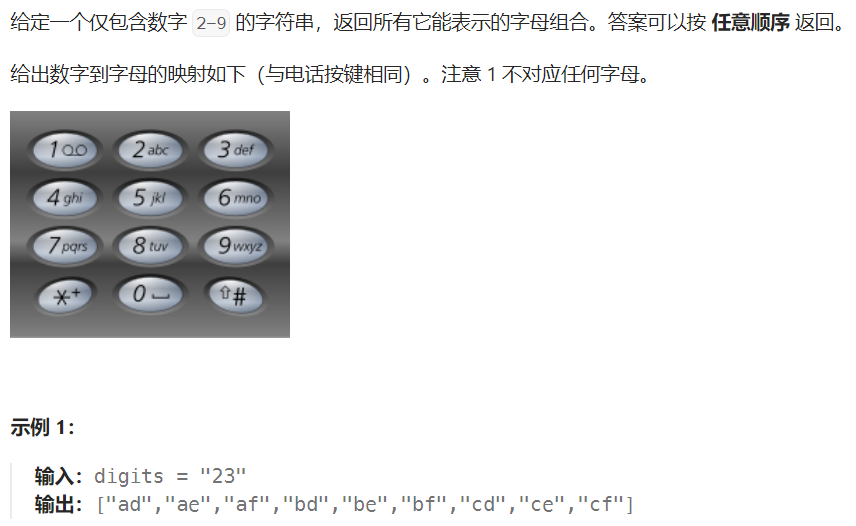

首先使用哈希表存储每个数字对应的所有可能的字母，然后进行回溯操作。

```c++
class Solution {
public:
    vector<string> letterCombinations(string digits) {
        vector<string> result;
        if (digits.empty()) {
            return result;
        }
        unordered_map<char, string> phoneMap{
            {'2', "abc"},
            {'3', "def"},
            {'4', "ghi"},
            {'5', "jkl"},
            {'6', "mno"},
            {'7', "pqrs"},
            {'8', "tuv"},
            {'9', "wxyz"}
        };
        string s;
        backtrack(result, phoneMap, digits, 0, s);
        return result;
    }

    void backtrack(vector<string>& result, unordered_map<char, string>& phoneMap, string& digits, int index, string& s) {
        if (index == digits.length()) {
            result.push_back(s);
        } else {
            char digit = digits[index];
            string letters = phoneMap.at(digit);
            for (char letter: letters) {
                s.push_back(letter);
                backtrack(result, phoneMap, digits, index + 1, s);
                s.pop_back();
            }
        }
    }
};
```


### 四数之和（排序+双指针）

https://leetcode.cn/problems/4sum/?envType=featured-list&envId=2cktkvj%3FenvType%3Dfeatured-list&envId=2cktkvj

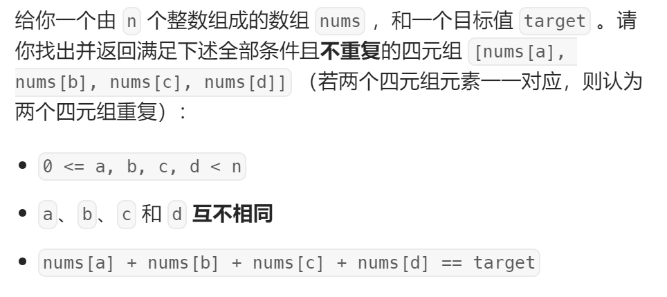

枚举的时间复杂度为O(n^4)，可以使用双指针的方式去掉一重循环

具体做法：使用两重循环分别枚举前两个数，然后在两重循环枚举到的数之后使用双指针枚举剩下的两个数。假设两重循环枚举到的前两个数分别位于下标 i 和 j，其中 i<j。初始时，左右指针分别指向下标 j+1 和下标 n−1。每次计算四个数的和，并进行如下操作：

- 如果和等于 target，则将枚举到的四个数加到答案中，然后将左指针右移直到遇到不同的数，将右指针左移直到遇到不同的数
- 如果和小于 target，则将左指针右移一位
- 如果和大于 target，则将右指针左移一位

```c++
class Solution {
public:
    vector<vector<int>> fourSum(vector<int>& nums, int target) {
        vector<vector<int>>result;
        if(nums.size()<4){
            return result;
        }
        sort(nums.begin(),nums.end());
        for(int i=0;i<nums.size()-3;i++){
            if(i>0&&nums[i]==nums[i-1]){
                continue;
            }
            for(int j=i+1;j<nums.size()-2;j++){
                if(j>i+1&&nums[j]==nums[j-1]){
                    continue;
                }
                int m=j+1,n=nums.size()-1;
                while(m<n){
                    if((long)nums[i]+nums[j]+nums[m]+nums[n]==target){
                        result.push_back({nums[i],nums[j],nums[m],nums[n]});
                        while(m<n&&nums[m]==nums[++m]);
                        while(m<n&&nums[n]==nums[--n]);
                    }else if((long)nums[i]+nums[j]+nums[m]+nums[n]<target){
                        m++;
                    }else{
                        n--;
                    }
                }
            }
        }
        return result;
    }
};
```


### 删除链表倒数第N个节点

> 在对链表进行操作时，一种常用的技巧是添加一个哑节点（dummy node），它的 next\textit{next}next 指针指向链表的头节点。这样一来，我们就不需要对头节点进行特殊的判断了。

思路：首先从头节点开始对链表进行一次遍历，得到链表的长度 L。随后我们再从头节点开始对链表进行一次遍历，当遍历到第 L−n+1个节点时，它就是我们需要删除的节点。

为了方便删除操作，我们可以从哑节点开始遍历 L−n+1个节点。当遍历到第 L−n+1个节点时，它的下一个节点就是我们需要删除的节点，这样我们只需要修改一次指针，就能完成删除操作。

```c++
class Solution {
public:
    int getLength(ListNode* head) {
        int length = 0;
        while (head) {
            ++length;
            head = head->next;
        }
        return length;
    }

    ListNode* removeNthFromEnd(ListNode* head, int n) {
        ListNode* dummy = new ListNode(0, head);
        int length = getLength(head);
        ListNode* cur = dummy;
        for (int i = 1; i < length - n + 1; ++i) {
            cur = cur->next;
        }
        cur->next = cur->next->next;
        ListNode* ans = dummy->next;
        delete dummy;
        return ans;
    }
};
```


### 有效的括号

https://leetcode.cn/problems/valid-parentheses/description/?envType=featured-list&envId=2cktkvj%3FenvType%3Dfeatured-list&envId=2cktkvj


判断括号的有效性可以使用**「栈」**这一数据结构来解决。

当我们遇到一个右括号时，我们需要将一个相同类型的左括号闭合。此时，我们可以取出栈顶的左括号并判断它们是否是相同类型的括号。如果不是相同的类型，或者栈中并没有左括号，那么字符串 s 无效，返回 False。为了快速判断括号的类型，我们可以使用哈希表存储每一种括号。**哈希表的键为右括号，值为相同类型的左括号。**

在遍历结束后，如果栈中没有左括号，说明我们将字符串 s中的所有左括号闭合，返回 True，否则返回 False。

```c++
class Solution {
public:
    bool isValid(string s) {
        if(s.size()%2){
            return false;
        }
        unordered_map<char,char>pairs={
            {')','('},
            {']','['},
            {'}','{'}
        };
        stack<char>stk;
        for(char ch:s){
            if(pairs.count(ch)){
                if(stk.empty()||stk.top()!=pairs[ch]){
                    return false;
                }
                stk.pop();
            }else{
                stk.push(ch);
            }
        }
        return stk.empty();
    }
};
```


### 合并两个有序链表（递归）

https://leetcode.cn/problems/merge-two-sorted-lists/description/?envType=featured-list&envId=2cktkvj%3FenvType%3Dfeatured-list&envId=2cktkvj

将两个升序链表合并为一个新的 **升序** 链表并返回。

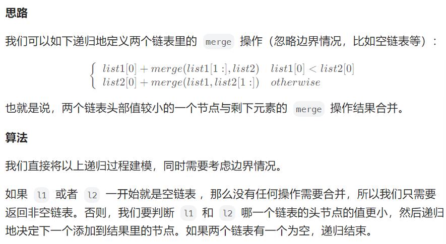

```c++
class Solution {
public:
    ListNode* mergeTwoLists(ListNode* l1, ListNode* l2) {
        if (l1 == nullptr) {
            return l2;
        } else if (l2 == nullptr) {
            return l1;
        } else if (l1->val < l2->val) {
            l1->next = mergeTwoLists(l1->next, l2);
            return l1;
        } else {
            l2->next = mergeTwoLists(l1, l2->next);
            return l2;
        }
    }
};
```


### 括号生成

https://leetcode.cn/problems/generate-parentheses/description/?envType=featured-list&envId=2cktkvj%3FenvType%3Dfeatured-list&envId=2cktkvj

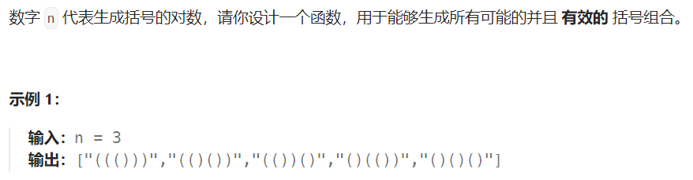

解题规律：剩余左括号总数要小于等于右括号

- 剩余左右括号数相等时，下一个只能用左括号
- 剩余左括号小于右括号时，下一个可以用左括号也可以用右括号

```c++
class Solution {
public:
    vector<string> generateParenthesis(int n) {
        vector<string>res;
        if(n<=0){
            return res;
        }
        getParenthesis(res,"",n,n);
        return res;
    }
    void getParenthesis(vector<string>& res,string str,int left,int right){
        if(left==0 && right==0){
            res.push_back(str);
            return;
        }
        if(left==right){
            getParenthesis(res,str+"(",left-1,right);
        }else if(left<right){
            if(left>0){
            getParenthesis(res,str+"(",left-1,right);
            }
            getParenthesis(res,str+")",left,right-1);
        }
    }
};
```


### 两两交换链表中的节点（迭代）

https://leetcode.cn/problems/swap-nodes-in-pairs/description/?envType=featured-list&envId=2cktkvj%3FenvType%3Dfeatured-list&envId=2cktkvj

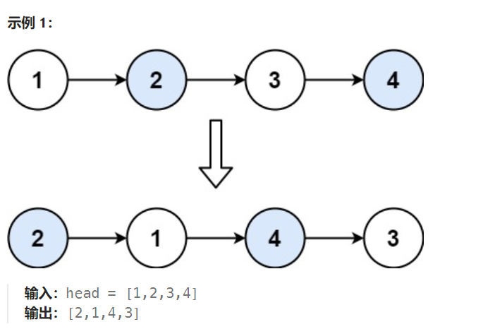

创建哑结点 dummyHead，令 dummyHead.next = head。令 temp 表示当前到达的节点，初始时 temp = dummyHead。每次需要交换 temp 后面的两个节点。

如果 temp 的后面没有节点或者只有一个节点，则没有更多的节点需要交换，因此结束交换。否则，获得 temp 后面的两个节点 node1 和 node2，通过更新节点的指针关系实现两两交换节点。

具体而言，交换之前的节点关系是 temp -> node1 -> node2，交换之后的节点关系要变成 temp -> node2 -> node1，最后令temp=node1，继续迭代。

```c++
class Solution {
public:
    ListNode* swapPairs(ListNode* head) {
        ListNode* dummyHead = new ListNode(0);
        dummyHead->next = head;
        ListNode* temp = dummyHead;
        while (temp->next != nullptr && temp->next->next != nullptr) {
            ListNode* node1 = temp->next;
            ListNode* node2 = temp->next->next;
            temp->next = node2;
            node1->next = node2->next;
            node2->next = node1;
            temp = node1;
        }
        ListNode* ans = dummyHead->next;
        delete dummyHead;
        return ans;
    }
};
```


### 删除有序数组中的重复项（双指针）

https://leetcode.cn/problems/remove-duplicates-from-sorted-array/description/?envType=featured-list&envId=2cktkvj%3FenvType%3Dfeatured-list&envId=2cktkvj

给你一个 **非严格递增排列** 的数组 `nums` ，请你**[ 原地](http://baike.baidu.com/item/原地算法)** 删除重复出现的元素，使每个元素 **只出现一次** ，返回删除后数组的新长度。元素的 **相对顺序** 应该保持 **一致** 。然后返回 `nums` 中唯一元素的个数。

> 注意：上述操作必须通过原地修改数组的方法，使用O(1)的空间复杂度完成

```c++
class Solution {
public:
    int removeDuplicates(vector<int>& nums) {
        int index=1;
        for(int i=1;i<nums.size();i++){
            if(nums[i]!=nums[i-1]){
                nums[index++]=nums[i];
            }
        }
        return index;
    }
};
```


### 移除元素（双指针）

https://leetcode.cn/problems/remove-element/description/?envType=featured-list&envId=2cktkvj%3FenvType%3Dfeatured-list&envId=2cktkvj

给你一个数组 `nums` 和一个值 `val`，你需要 **[原地](https://baike.baidu.com/item/原地算法)** 移除所有数值等于 `val` 的元素，并返回移除后数组的新长度。

> 注意：不要使用额外的数组空间，必须仅使用O(1)的额外空间并原地修改输入数组

```c++
class Solution {
public:
    int removeElement(vector<int>& nums, int val) {
        int index=0;
        for(int i=0;i<nums.size();i++){
            if(nums[i]!=val){
                nums[index++]=nums[i];
            }
        }
        return index;
    }
};
```


### 字符串匹配

给你两个字符串 `haystack` 和 `needle` ，请你在 `haystack` 字符串中找出 `needle` 字符串的第一个匹配项的下标（下标从 0 开始）。如果 `needle` 不是 `haystack` 的一部分，则返回 `-1` 。

本题可以直接一行解决，即调用find方法

```c++
class Solution {
public:
    int strStr(string haystack, string needle) {
        return haystack.find(needle);
    }
};
```

但从算法角度看，本题真正的解法如下：

> 常见的字符串匹配算法包括KMP算法，其核心在于前缀表，即next数组
>
> - 长度为前1个字符的子串`a`，最长相同前后缀的长度为0
> - 长度为前2个字符的子串`aa`，最长相同前后缀的长度为1
> - 长度为前3个字符的子串`aab`，最长相同前后缀的长度为0

构造next数组：

```c++
 void getNext(int* next, const string& s) {
        int j = 0;
        next[0] = 0;
        for(int i = 1; i < s.size(); i++) {
            while (j > 0 && s[i] != s[j]) { // j要保证大于0，因为下面有取j-1作为数组下标的操作
                j = next[j - 1]; // 注意这里，是要找前一位的对应的回退位置了
            }
            if (s[i] == s[j]) {
                j++;
            }
            next[i] = j;
        }
    }
```

使用next数组用来做匹配

```c++
 int strStr(string haystack, string needle) {
        if (needle.size() == 0) {
            return 0;
        }
        int next[needle.size()];
        getNext(next, needle);
        int j = 0;
        for (int i = 0; i < haystack.size(); i++) {
            while(j > 0 && haystack[i] != needle[j]) {
                j = next[j - 1];
            }
            if (haystack[i] == needle[j]) {
                j++;
            }
            if (j == needle.size() ) {
                return (i - j + 1);
            }
        }
        return -1;
    }
};
```


### 下一个排列

https://leetcode.cn/problems/next-permutation/description/?envType=featured-list&envId=2cktkvj%3FenvType%3Dfeatured-list&envId=2cktkvj

整数数组的 **下一个排列** 是指其整数的下一个字典序更大的排列。如果不存在下一个更大的排列，那么这个数组必须重排为字典序最小的排列（即，其元素按升序排列）。

必须**[ 原地 ](https://baike.baidu.com/item/原地算法)**修改，只允许使用额外常数空间。

- `arr = [1,2,3]` 的下一个排列是 `[1,3,2]` 。
- `arr = [2,3,1]` 的下一个排列是 `[3,1,2]` 。
- `arr = [3,2,1]` 的下一个排列是 `[1,2,3]` ，因为 `[3,2,1]` 不存在一个字典序更大的排列。

> 思路：我们希望找到一个大于当前序列的新序列，且变大的幅度尽可能小：
>
> 1. 需要将一个左边的**较小数**与一个右边的**较大数**交换，从而让当前排列变大，得到下一个排列
> 2. 同时要让这个**较小数**尽可能靠右，而**较大数**尽可能小。当交换完成后，**较大数**右边的数需要按照升序重新排列，从而保证变大的幅度尽可能小

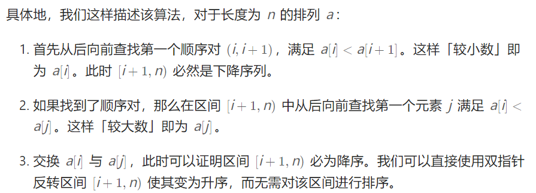

注意：如果在步骤1中找不到该顺序对，说明当前序列已经是一个降序序列，即最大的序列。那么可以直接跳过步骤2执行步骤3，即可得到最小的升序序列

```c++
class Solution {
public:
    void nextPermutation(vector<int>& nums) {
        int i = nums.size() - 2;
        while (i >= 0 && nums[i] >= nums[i + 1]) {
            i--;
        }
        if (i >= 0) {
            int j = nums.size() - 1;
            while (j >= 0 && nums[i] >= nums[j]) {
                j--;
            }
            swap(nums[i], nums[j]);
        }
        reverse(nums.begin() + i + 1, nums.end());//reverse和sort均可，因为是对降序序列进行操作
    }
};
```


### 搜索旋转排序数组（二分查找）

https://leetcode.cn/problems/search-in-rotated-sorted-array/?envType=featured-list&envId=2cktkvj%3FenvType%3Dfeatured-list&envId=2cktkvj

在传递给函数之前，`nums` 在预先未知的某个下标 `k`（`0 <= k < nums.length`）上进行了 **旋转**，使数组变为 `[nums[k], nums[k+1], ..., nums[n-1], nums[0], nums[1], ..., nums[k-1]]`（下标 **从 0 开始** 计数）。例如， `[0,1,2,4,5,6,7]` 在下标 `3` 处经旋转后可能变为 `[4,5,6,7,0,1,2]` 。

给你 **旋转后** 的数组 `nums` 和一个整数 `target` ，如果 `nums` 中存在这个目标值 `target` ，则返回它的下标，否则返回 `-1` 。

> 对于有序数组，可以使用二分查找的方式查找元素
>
> 但对于本题来说，数组本身不是有序的，进行旋转后只保证了数组局部是有序的，但依然可以进行二分查找
>
> 在常规二分查找的时候查看当前 mid 为分割位置分割出来的两个部分 [left, mid] 和 [mid + 1, right] 哪个部分是有序的，并根据有序的那个部分确定我们该如何改变二分查找的上下界，因为我们能够根据有序的那部分判断出 target 在不在这个部分：
>
> - 如果 [left, mid - 1] 是有序数组，且 target 的大小满足 [nums[left],nums[mid])，则我们应该将搜索范围缩小至 [left, mid - 1]，否则在 [mid + 1, r] 中寻找。
>
> - 如果 [mid, right] 是有序数组，且 target 的大小满足 (nums[mid+1],nums[right])，则我们应该将搜索范围缩小至 [mid + 1, right]，否则在 [l, mid - 1] 中寻找。

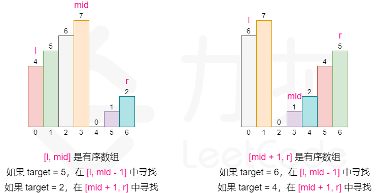

```c++
class Solution {
public:
    int search(vector<int>& nums, int target) {
        int n = (int)nums.size();
        int l = 0, r = n - 1;
        while (l <= r) {
            int mid = (l + r) / 2;
            if (nums[mid] == target) return mid;
            if (nums[0] <= nums[mid]) {
                if (nums[0] <= target && target < nums[mid]) {
                    r = mid - 1;
                } else {
                    l = mid + 1;
                }
            } else {
                if (nums[mid] < target && target <= nums[n - 1]) {
                    l = mid + 1;
                } else {
                    r = mid - 1;
                }
            }
        }
        return -1;
    }
};
```

注意：二分查找一定是while(l<=r)


### 在排序数组中查找元素的第一个和最后一个位置（二分查找）

https://leetcode.cn/problems/find-first-and-last-position-of-element-in-sorted-array/description/?envType=featured-list&envId=2cktkvj%3FenvType%3Dfeatured-list&envId=2cktkvj

给你一个按照非递减顺序排列的整数数组 `nums`，和一个目标值 `target`。请你找出给定目标值在数组中的开始位置和结束位置。

如果数组中不存在目标值 `target`，返回 `[-1, -1]`。

> 思路：因为整个数组是单调递增的，可以利用二分法来加速查找的过程。用两个遍历first和last来记录第一次和最后一次遇见等于target的位置。因此，需要进行两次正常的二分查找即可

```c++
 // 两次二分查找，分开查找第一个和最后一个
 // 时间复杂度 O(log n), 空间复杂度 O(1)
  class Solution {
  public:
    vector<int> searchRange(vector<int>& nums, int target) {
    int left = 0, right = nums.size() - 1;
    int first = -1, last = -1;
    // 找第一个等于target的位置
    while (left <= right) {
      int middle = (left + right) / 2;
      if (nums[middle] == target) {
        first = middle;
        right = middle - 1; //重点
      } else if (nums[middle] > target) {
        right = middle - 1;
      } else {
        left = middle + 1;
      }
    }
    // 找最后一个等于target的位置
    left = 0，right = nums.length - 1;
    while (left <= right) {
      int middle = (left + right) / 2;
      if (nums[middle] == target) {
        last = middle;
        left = middle + 1; //重点
      } else if (nums[middle] > target) {
        right = middle - 1;
      } else {
        left = middle + 1;
      }
    }
    return {first, last};
  }
```


### 搜索插入位置（二分查找）

https://leetcode.cn/problems/search-insert-position/description/?envType=featured-list&envId=2cktkvj%3FenvType%3Dfeatured-list&envId=2cktkvj

给定一个排序数组和一个目标值，在数组中找到目标值，并返回其索引。如果目标值不存在于数组中，返回它将会被按顺序插入的位置。

> 二分查找法 O(logn)
>
> - 如果存在目标值，直接返回
> - 否则一直搜索，最后返回left（插入位置一定在left，而且left最终一定等于right+1）

```c++
class Solution {
public:
    int searchInsert(vector<int>& nums, int target) {
        int l=0,r=nums.size()-1;
        while(l<=r){
            int mid=(l+r)/2;
            if(target==nums[mid]){
                return mid;
            }else if(target<nums[mid]){
                r=mid-1;
            }else{
                l=mid+1;
            }
        }
        return l; 
    }
};
```


### 有效的数独

> 有效的数独满足以下三个条件：
>
> - 同一个数字在每一行只能出现一次；
> - 同一个数字在每一列只能出现一次；
> - 同一个数字在每一个小九宫格只能出现一次。

可以使用哈希表记录每一行、每一列和每一个小九宫格中，每个数字出现的次数。只需要遍历数独一次，在遍历的过程中更新哈希表中的计数，并判断是否满足有效的数独的条件即可。

具体做法：创建二维数组rows和columns分别记录数独的每一行和每一列中的每个数字的出现次数，创建三维数组subbox记录每一个小九宫格中每个数字的出现此时。其中rows [i] [index]、columns [i] [index]和subbox[i/3] [j/3] [index]分别表示数独的第i行第j列的单元格所在的行、列和小九宫格中，数字index+1出现的次数

```c++
class Solution {
    public boolean isValidSudoku(char[][] board) {
        vector<vector<int>> rows(9,vector<int>(9,0));
        vector<vector<int>> columns(9,vector<int>(9,0));
        vector<vector<vector<int>>> subbox(3,vector<vector<int>>(3,vector<int>(9,0)));
        for (int i = 0; i < 9; i++) {
            for (int j = 0; j < 9; j++) {
                char c = board[i][j];
                if (c != '.') {
                    int index = c - '0' - 1;
                    rows[i][index]++;
                    columns[j][index]++;
                    subboxes[i / 3][j / 3][index]++;
                    if (rows[i][index] > 1 || columns[j][index] > 1 || subbox[i / 3][j / 3][index] > 1) {
                        return false;
                    }
                }
            }
        }
        return true;
    }
}
```


### 解数独

https://leetcode.cn/problems/sudoku-solver/description/?envType=featured-list&envId=2cktkvj%3FenvType%3Dfeatured-list&envId=2cktkvj

```c++
class Solution {
public:
bool backtrack(vector<vector<char>>& board){
    for(int row=0;row<9;row++){
        for(int col=0;col<9;col++){
            if(board[row][col]=='.'){
                for(char k='1';k<='9';k++){
                    if(isValid(row,col,k,board)){
                        board[row][col]=k;
                        if(backtrack(board)){
                            return true;
                        }
                        board[row][col]='.';
                    }
                }
                return false;
            }
        }
    }
    return true;
}
bool isValid(int row,int col,int k,vector<vector<char>>&board){
    for(int i=0;i<9;i++){
        if(board[row][i]==k){
            return false;
        }
    }
    for(int j=0;j<9;j++){
        if(board[j][col]==k){
            return false;
        }
    }
    int startRow=(row/3)*3;
    int startCol=(col/3)*3;
    for(int i=startRow;i<startRow+3;i++){
        for(int j=startCol;j<startCol+3;j++){
            if(board[i][j]==k){
                return false;
            }
        }
    }
    return true;
}
    void solveSudoku(vector<vector<char>>& board) {
       backtrack(board);
    }
};
```


### 外观数列

https://leetcode.cn/problems/count-and-say/description/?envType=featured-list&envId=2cktkvj%3FenvType%3Dfeatured-list&envId=2cktkvj

给定一个正整数 `n` ，输出外观数列的第 `n` 项。

「外观数列」是一个整数序列，从数字 1 开始，序列中的每一项都是对前一项的描述。

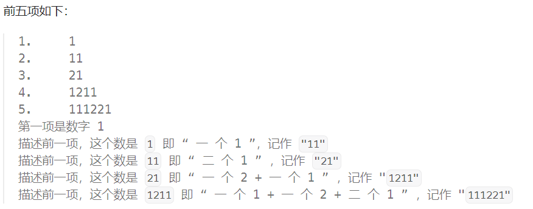

例如，数字字符串 `"3322251"` 的描述如下图：

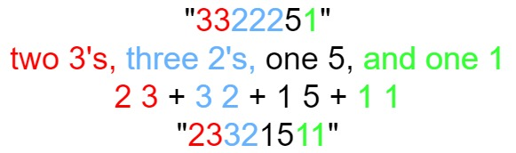

> 外观数列，本质上只是依次统计字符串中连续相同字符的个数

```c++
class Solution {
public:
    string countAndSay(int n) {
        string prev = "1";
        for (int i = 2; i <= n; ++i) {
            string curr = "";
            int start = 0;
            int pos = 0;

            while (pos < prev.size()) {
                while (pos < prev.size() && prev[pos] == prev[start]) {
                    pos++;
                }
                curr += to_string(pos - start) + prev[start];
                start = pos;
            }
            prev = curr;
        }
        
        return prev;
    }
};
```


### 组合总和（回溯）

https://leetcode.cn/problems/combination-sum/description/?envType=featured-list&envId=2cktkvj%3FenvType%3Dfeatured-list&envId=2cktkvj

给你一个 **无重复元素** 的整数数组 `candidates` 和一个目标整数 `target` ，找出 `candidates` 中可以使数字和为目标数 `target` 的 所有 **不同组合** ，并以列表形式返回。你可以按 **任意顺序** 返回这些组合。

`candidates` 中的 **同一个**数字可以**无限制重复被选取** 。如果至少一个数字的被选数量不同，则两种组合是不同的

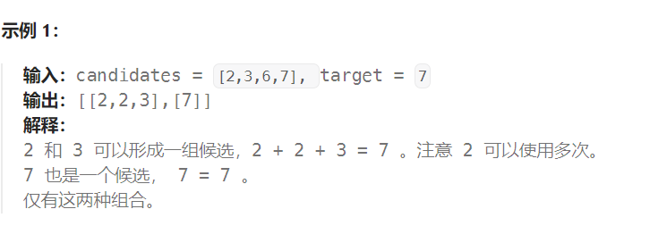

```c++
class Solution {
public:
    vector<vector<int>> paths;
    vector<int> path;
    int sum;
    
    vector<vector<int>> combinationSum(vector<int>& candidates, int target) {
        backtracking(candidates, target, 0);
        return paths;
    }
    
    void backtracking(vector<int>& candidates, int target, int startindex) {
        if (sum == target) {
            paths.push_back(path);
            return;
        }
        if (sum > target) {
            return;
        }
        for (int i = startindex; i < candidates.size(); i++) {
            path.push_back(candidates[i]);
            sum += path.back();
            backtracking(candidates, target, i);
            sum -= path.back();
            path.pop_back();
        }
    }
};
```


### 组合总和II（回溯）

https://leetcode.cn/problems/combination-sum-ii/description/?envType=featured-list&envId=2cktkvj%3FenvType%3Dfeatured-list&envId=2cktkvj

给定一个候选人编号的集合 `candidates` 和一个目标数 `target` ，找出 `candidates` 中所有可以使数字和为 `target` 的组合。

`candidates` 中的每个数字在每个组合中只能使用 **一次** 。

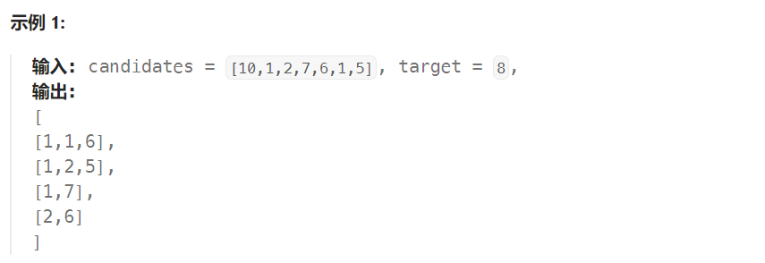

```c++
class Solution {
public:
    vector<vector<int>> paths;
    vector<int> path;
    int sum;
    
    vector<vector<int>> combinationSum(vector<int>& candidates, int target) {
        sort(candidates.begin(),candidates.end());//排序
        backtracking(candidates, target, 0);
        return paths;
    }
    
    void backtracking(vector<int>& candidates, int target, int startindex) {
        if (sum == target) {
            paths.push_back(path);
            return;
        }
        if (sum > target) {
            return;
        }
        for (int i = startindex; i < candidates.size(); i++) {
            if(i>index&&candidates[i]==candidates[i-1]){
                continue; //去重
            }
            path.push_back(candidates[i]);
            sum += path.back();
            backtracking(candidates, target, i+1);//i+1
            sum -= path.back();
            path.pop_back();
        }
    }
};
```


### 接雨水（单调栈）

https://leetcode.cn/problems/trapping-rain-water/description/?envType=featured-list&envId=2cktkvj%3FenvType%3Dfeatured-list&envId=2cktkvj

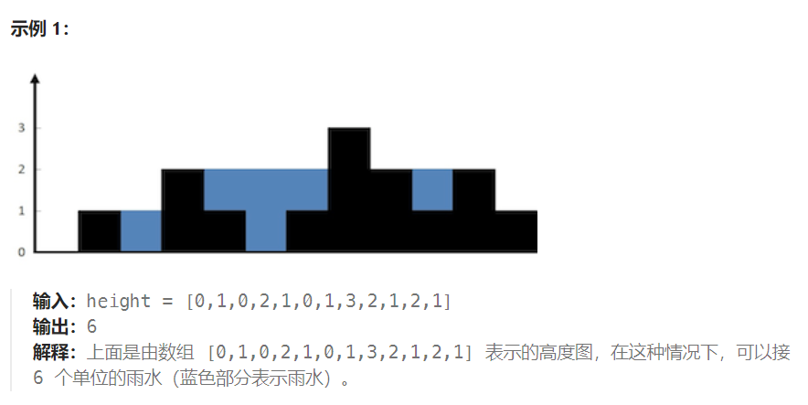

> 维护一个单调栈，单调栈存储的是下标，满足从栈底到栈顶的下标对应的数组height中的元素递减
>
> 从左到右遍历数组，遍历到下标 i 时，如果栈内至少有两个元素，记栈顶元素为top，top下面一个元素是left，则一定有height[left]≥height[top]。如果height[i]>height[top]，则得到一个可以接水的区域，该区域的宽度是i-left-1，高度是min(height[left]，height[i])-height[top]。根据宽度和高度即可计算得到该区域能够接的雨水量
>
> 为了得到left，需要将top出栈，重复上述操作直到栈为空或者height[top]≥height[i]
>
> 在对下标i处计算能接的雨水量后，将i入栈，继续遍历后面的下标

```c++
class Solution {
public:
    int trap(vector<int>& height) {
        int ans = 0;
        stack<int> stk;
        int n = height.size();
        for (int i = 0; i < n; ++i) {
            while (!stk.empty() && height[i] > height[stk.top()]) {
                int top = stk.top();
                stk.pop();
                if (!stk.empty()) {
                    int left = stk.top();
                    int currWidth = i - left - 1;
                    int currHeight = min(height[left], height[i]) - height[top];
                    ans += currWidth * currHeight;
                }
            }
            stk.push(i);
        }
        return ans;
    }
};
```


### 跳跃游戏II（贪心算法）

给定一个长度为 `n` 的 **0 索引**整数数组 `nums`。初始位置为 `nums[0]`。

每个元素 `nums[i]` 表示从索引 `i` 向前跳转的最大长度。换句话说，如果你在 `nums[i]` 处，你可以跳转到任意 `nums[i + j]` 处:

> 贪心地正向查找，每次找到可到达的最远位置，就可以在线性时间内得到最少的跳跃次数
>
> 维护当前能够到达的最大下标位置，记为边界。我们从左到右遍历数组，到达边界时，更新边界并将跳跃次数增加1。注意：在遍历数组时不访问最后一个元素

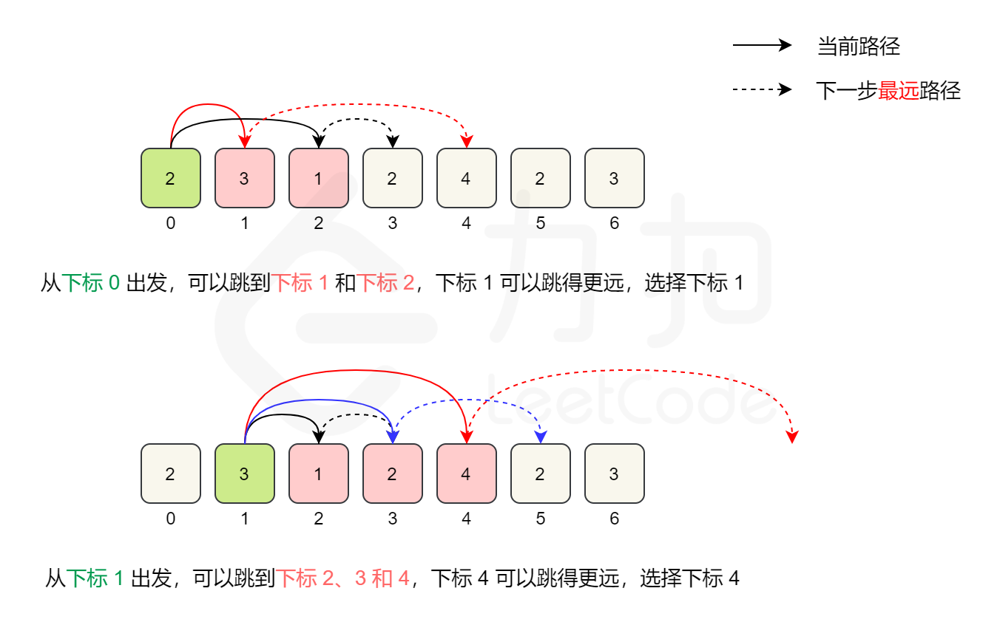

```c++
class Solution {
public:
    int jump(vector<int>& nums) {
        int maxPos=0,end=0,step=0;
        for(int i=0;i<nums.size()-1;i++){
            maxPos=max(maxPos,i+nums[i]);
            if(i==end){
                end=maxPos;
                step++;
            }
        }
        return step;
    }
};
```


### 全排列（回溯）

给定一个**不含重复数字**的数组 `nums` ，返回其 *所有可能的全排列* 。你可以 **按任意顺序** 返回答案。

```c++
class Solution {
public:
    vector<int> path;
    vector<vector<int>> result;
    void backtrack(vector<int> nums, vector<bool> used) {
        if(path.size()==nums.size()){
            result.push_back(path);
            return;
        }
        for(int i=0;i<nums.size();i++){
            if(used[i]==true){
                continue;
            }
            path.push_back(nums[i]);
            used[i]=true;
            backtrack(nums,used);
            path.pop_back();
            used[i]=false;
        }
    }
    vector<vector<int>> permute(vector<int>& nums) {
        vector<bool>used(nums.size(),false);
        backtrack(nums,used);
        return result;
    }
};
```


### 全排列II

给定一个可**包含重复数字**的序列 `nums` ，***按任意顺序*** 返回所有不重复的全排列。

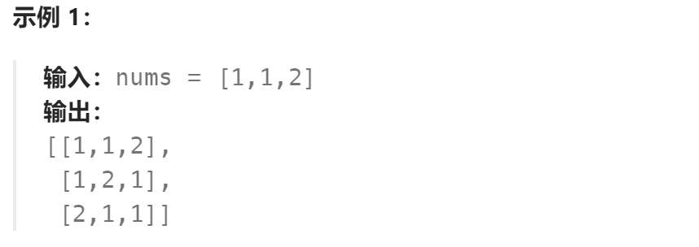

```c++
class Solution {
private:
    vector<int> path;
    vector<vector<int>> result;
    void backtrack(vector<int> nums, vector<bool> used) {
        if (path.size() == nums.size()) {
            result.push_back(path);
            return;
        }
        for (int i = 0; i < nums.size(); i++) {
            //这个位置的数已经填过 或者是 这个位置的前面有相等的数没填过
            if (used[i] == true ||(i > 0 && nums[i] == nums[i - 1] && used[i - 1] == false)) {
                continue;
            }
            used[i] = true;
            path.push_back(nums[i]);
            backtrack(nums, used);
            path.pop_back();
            used[i] = false;
        }
    }

public:
    vector<vector<int>> permuteUnique(vector<int>& nums) {
        vector<bool> used(nums.size(), false);
        sort(nums.begin(), nums.end()); //排序
        backtrack(nums, used);
        return result;
    }
};
```


### 旋转图像

给定一个 *n* × *n* 的二维矩阵 `matrix` 表示一个图像。请你将图像**顺时针旋转 90 度**。

你必须在**[ 原地](https://baike.baidu.com/item/原地算法)** 旋转图像，这意味着你需要直接修改输入的二维矩阵。请不要 使用另一个矩阵来旋转图像。

> 1. 对矩阵进行转置，即将矩阵的行和列进行交换。
> 2. 对每一行进行反转，即将每一行的元素顺序进行反转。

```c++
class Solution {
    public void rotate(int[][] matrix) {
        int n = matrix.size();

        // 第一步，转置矩阵
        for (int i = 0; i < n; i++) {
            for (int j = i; j < n; j++) {
                int temp = matrix[i][j];
                matrix[i][j] = matrix[j][i];
                matrix[j][i] = temp;
            }
        }

        // 第二步，反转每一行
        for (int i = 0; i < n; i++) {
            int left = 0;
            int right = n - 1;
            while (left < right) {
                int temp = matrix[i][left];
                matrix[i][left] = matrix[i][right];
                matrix[i][right] = temp;
                left++;
                right--;
            }
        }
    }
}
```


### 字母异位词

给你一个字符串数组，请你将 **字母异位词** 组合在一起。可以按任意顺序返回结果列表。

**字母异位词** 是由重新排列源单词的所有字母得到的一个新单词。

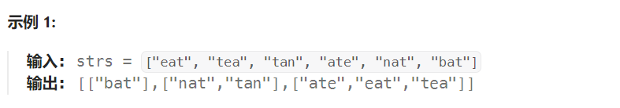

> 两个字符串互为字母异位词当且仅当两个字符串包含的字母相同，因此对两个字符串分别进行排序之后得到的字符串一定是相同的，故可以将排序之后的字符串作为哈希表的键

```c++
class Solution {
public:
    vector<vector<string>> groupAnagrams(vector<string>& strs) {
        unordered_map<string, vector<string>> mp;
        for (string& str: strs) {
            string key = str;
            sort(key.begin(), key.end());//排序
            mp[key].push_back(str);
        }
        vector<vector<string>> ans;
        //或者 for(auto it:mp){}
        for (auto it = mp.begin(); it != mp.end(); it++) {
            ans.push_back(it->second);//it->first获取key，it->second获取value值
        }
        return ans;
    }
};
```


### N皇后（回溯）

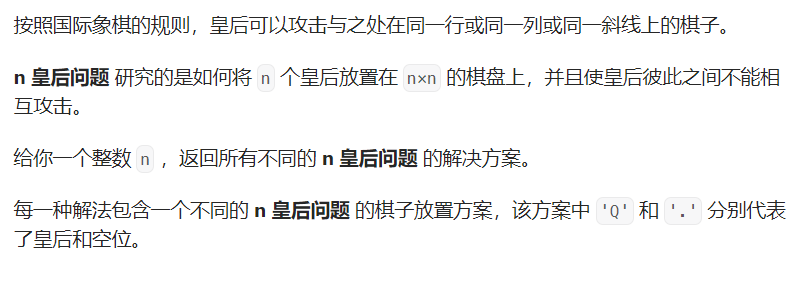

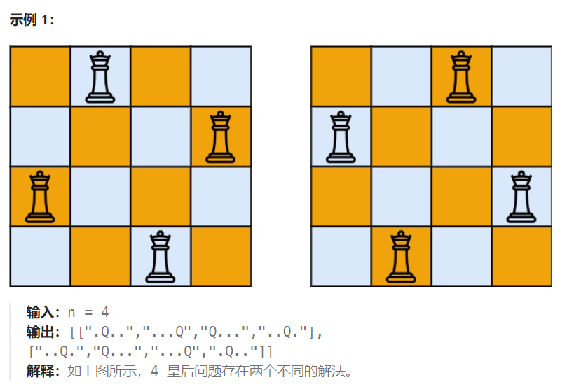

> 验证棋盘是否合法：
>
> - 不能同行
> - 不能同列
> - 不能同斜线（45度和135度）

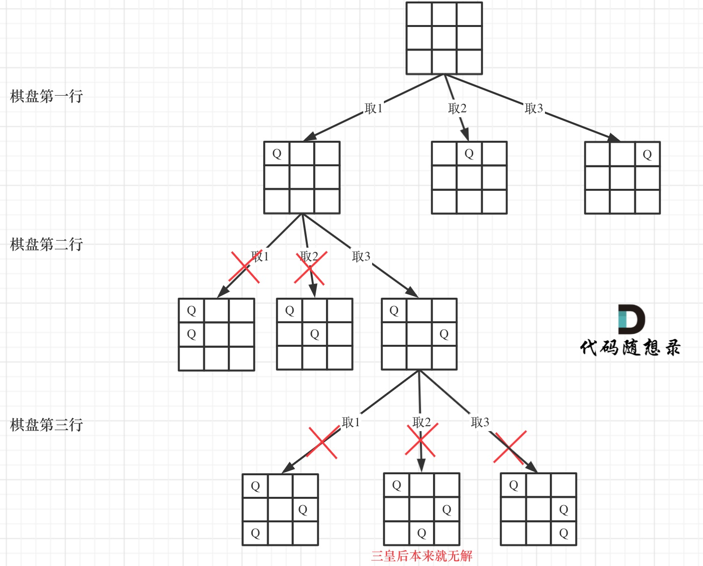

```c++
class Solution {
private:
vector<vector<string>> result;
// n 为输入的棋盘大小
// row 是当前递归到棋盘的第几行了
void backtracking(int n, int row, vector<string>& chessboard) {
    if (row == n) {
        result.push_back(chessboard);
        return;
    }
    for (int col = 0; col < n; col++) {
        if (isValid(row, col, chessboard, n)) { // 验证合法就可以放
            chessboard[row][col] = 'Q'; // 放置皇后
            backtracking(n, row + 1, chessboard);
            chessboard[row][col] = '.'; // 回溯，撤销皇后
        }
    }
}
bool isValid(int row, int col, vector<string>& chessboard, int n) {
    // 检查列
    for (int i = 0; i < row; i++) { // 这是一个剪枝
        if (chessboard[i][col] == 'Q') {
            return false;
        }
    }
    // 检查 45度角是否有皇后
    for (int i = row - 1, j = col - 1; i >=0 && j >= 0; i--, j--) {
        if (chessboard[i][j] == 'Q') {
            return false;
        }
    }
    // 检查 135度角是否有皇后
    for(int i = row - 1, j = col + 1; i >= 0 && j < n; i--, j++) {
        if (chessboard[i][j] == 'Q') {
            return false;
        }
    }
    return true;
}
public:
    vector<vector<string>> solveNQueens(int n) {
        vector<string> chessboard(n, string(n, '.'));
        backtracking(n, 0, chessboard);
        return result;
    }
};
```


### 最大子数组和

给你一个整数数组 `nums` ，请你找出一个具有最大和的连续子数组（子数组最少包含一个元素），返回其最大和。**子数组**是数组中的一个**连续**部分。

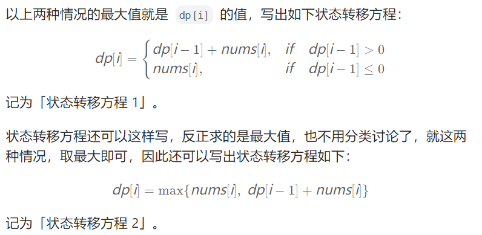

```c++
class Solution {
public:
    int maxSubArray(vector<int>& nums) {
        vector<int> dp(nums.size(), 0);
        dp[0] = nums[0];
        int res = dp[0];
        for (int i = 1; i < nums.size(); i++) {
            if (dp[i - 1] > 0) {
                dp[i] = dp[i - 1] + nums[i];
            } else {
                dp[i] = nums[i];
            }
            res = max(res, dp[i]);
        }
        return res;
    }
};
```


### 螺旋矩阵（按层模拟）

```c++
class Solution {
public:
    vector<int> spiralOrder(vector<vector<int>>& matrix) {
        int row = matrix.size();
        int col = matrix[0].size();
        int left = 0, right = col - 1, top = 0, bottom = row - 1;
        vector<int> result;
        while (left <= right && top <= bottom) {
            for (int j = left; j <= right; j++) {
                result.push_back(matrix[top][j]);
            }
            for (int i = top + 1; i <= bottom; i++) {
                result.push_back(matrix[i][right]);
            }
            if (left < right && top < bottom) {
                for (int j = right - 1; j >= left; j--) {
                    result.push_back(matrix[bottom][j]);
                }
                for (int i = bottom - 1; i > top; i--) {
                    result.push_back(matrix[i][left]);
                }
            }
            left++;
            right--;
            top++;
            bottom--;
        }
        return result;
    }
};
```

### 插入区间（模拟）


```c++
class Solution {
public:
    vector<vector<int>> insert(vector<vector<int>>& intervals, vector<int>& newInterval) {
        int left = newInterval[0];
        int right = newInterval[1];
        bool placed = false;
        vector<vector<int>> ans;
        for (vector<int> interval: intervals) {
            if (interval[0] > right) {
                // 在插入区间的右侧且无交集
                if (!placed) {
                    ans.push_back({left, right});
                    placed = true;                    
                }
                ans.push_back(interval);
            }
            else if (interval[1] < left) {
                // 在插入区间的左侧且无交集
                ans.push_back(interval);
            }
            else {
                // 与插入区间有交集，计算它们的并集
                left = min(left, interval[0]);
                right = max(right, interval[1]);
            }
        }
        if (!placed) {
            ans.push_back({left, right});
        }
        return ans;
    }
};
```

### 最后一个单词的长度（反向遍历）

给你一个字符串 `s`，由若干单词组成，单词前后用一些空格字符隔开。返回字符串中 **最后一个** 单词的长度。

**示例 1：**

```
输入：s = "Hello World"
输出：5
解释：最后一个单词是“World”，长度为 5。
```

**示例 2：**

```
输入：s = "   fly me   to   the moon  "
输出：4
解释：最后一个单词是“moon”，长度为 4。
```

**解题思路：**

完整过程为先从后过滤掉空格找到单词尾部，再从尾部向前遍历，找到单词头部

> 从最后一个字母开始继续反向遍历字符串，直到遇到空格或者到达字符串的起始位置。遍历到的每个字母都是最后一个单词中的字母，因此遍历到的字母数量即为最后一个单词的长度。
>

```c++
class Solution {
public:
    int lengthOfLastWord(string s) {
        int index = s.size() - 1;
        //过滤掉空格找到单词尾部
        while (s[index] == ' ') {
            index--;
        }
        int wordLength = 0;
        //从尾部向前遍历，找到单词头部
        while (index >= 0 && s[index] != ' ') {
            wordLength++;
            index--;
        }

        return wordLength;
    }
};
```

### 旋转链表（模拟）

给你一个链表的头节点 `head` ，旋转链表，将链表每个节点向右移动 `k` 个位置。示例如下：


> 假设链表的长度为n，为了将链表每个节点向右移动 k 个位置，我们只需要将链表的**后 k % n个**节点移动到链表的最前面，然后将链表的后k % n个节点和前 n - k个节点连接到一块即可。
>

- 首先遍历整个链表，求出链表的长度`n`，并找出链表的尾节点`tail`。

  

- 令 k = k % n，然后再次从头节点head开始遍历，找到第n - k个节点p，那么1 ~ p是链表的前 n - k个节点，p+1 ~ n是链表的后k个节点。

  

- 依次执行 tail->next = head，head = p->next，p->next = nullptr，将链表的后k个节点和前 n - k个节点拼接到一块，并让head指向新的头节点(p->next)，新的尾节点即p节点的next指针指向null。

  

- 最后返回链表的新的头节点`head`。

```c++
class Solution {
public:
    ListNode* rotateRight(ListNode* head, int k) {
        if(head == nullptr){
            return head;
        }
        int n = 0;        //链表长度
        ListNode* tail;    //尾节点
        ListNode* cur=head;
        while(cur!=nullptr){
            tail=cur;
            cur=cur->next;
            n++;
        }
        k %= n;  
        ListNode* p = head;
        for(int i = 0; i < n - k - 1; i++){
            p = p->next;  //找到链表的第n-k个节点
        }   
        
        tail->next = head;
        head = p->next;
        p->next = nullptr;
        
        return head;     //返回新的头节点
    }
};
```

### 不同路径（动态规划）

一个机器人位于一个 `m x n` 网格的左上角 （起始点在下图中标记为 “Start” ）。

机器人每次只能向下或者向右移动一步。机器人试图达到网格的右下角（在下图中标记为 “Finish” ）。

问总共有多少条不同的路径？

> 我们令 dp[i] [j] 表示从左上角走到 (i,j)的路径数量，其中 i和 j 的范围分别是 [0,m)和 [0,n)。
>
> 动态方程：dp[i] [j] = dp[i-1] [j] + dp[i] [j-1]
>
> 注意，对于第一行 dp[0] [j]，或者第一列 dp[i] [0]，由于都是在边界所以只能为 1
>
> 时间复杂度：O(m∗n)
>

```c++
class Solution {
public:
    int uniquePaths(int m, int n) {
        vector<vector<int>> dp(m, vector<int>(n));
        for (int i = 0; i < m; ++i) {
            dp[i][0] = 1;
        }
        for (int j = 0; j < n; ++j) {
            dp[0][j] = 1;
        }
        for (int i = 1; i < m; ++i) {
            for (int j = 1; j < n; ++j) {
                dp[i][j] = dp[i - 1][j] + dp[i][j - 1];
            }
        }
        return dp[m - 1][n - 1];
    }
};
```

### 不同路径II

一个机器人位于一个 `m x n` 网格的左上角 （起始点在下图中标记为 “Start” ）。

机器人每次只能向下或者向右移动一步。机器人试图达到网格的右下角（在下图中标记为 “Finish”）。

现在考虑网格中有**障碍物**。那么从左上角到右下角将会有多少条不同的路径？

> 对于`(i,j)`这个点来说，其动态规划转移方程就是：
>
> if 当前点不是障碍物：
>     dp[i] [j] = dp[i - 1] [j] + dp[i] [j - 1]
> else:
>     dp[i] [j] = 0

我们还需要处理下边界情况，也就是**第一列**、**第一行**时


如上图，只要第一列中的某个格子是**障碍物**，那么这个格子跟后面的都无法到达。
同理，第一行中如果有格子是**障碍物**，那么这个格子跟后面的都无法到达了。

```c++
class Solution {
public:
    int uniquePathsWithObstacles(vector<vector<int>>& obstacleGrid){
        int m = obstacleGrid.size();
        int n = obstacleGrid[0].size();
        vector<vector<int>> dp(m, vector<int>(n));
        //(0,0)这个格子可能有障碍物
        dp[0][0] = (obstacleGrid[0][0] == 1) ? 0 : 1;
        //处理第一列
        for(int i = 1; i < m; ++i) {
            if(obstacleGrid[i][0] == 1 || dp[i - 1][0] == 0) {
                dp[i][0] = 0;
            } else {
                dp[i][0] = 1;
            }
        }
        //处理第一行
        for(int j = 1; j < n; ++j) {
            if(obstacleGrid[0][j] == 1 || dp[0][j - 1] == 0) {
                dp[0][j] = 0;
            } else {
                dp[0][j] = 1;
            }
        }
        for(int i = 1; i < m; ++i) {
            for(int j = 1; j < n; ++j) {
                 //如果当前格子是障碍物
                if(obstacleGrid[i][j] == 1) {
                    dp[i][j] = 0;
                //路径总数来自于上方(dp[i-1][j])和左方(dp[i][j-1])    
                } else {
                    dp[i][j] = dp[i - 1][j] + dp[i][j - 1];
                }
            }
        }
        return dp[m - 1][n - 1];
    }
};
```

### 最小路径和

给定一个包含非负整数的 `m*n` 网格 `grid` ，请找出一条从左上角到右下角的路径，使得路径上的数字总和为最小。

**说明：**每次只能向下或者向右移动一步。


```
输入：grid = [[1,3,1],[1,5,1],[4,2,1]]
输出：7
解释：因为路径 1→3→1→1→1 的总和最小。
```

dp[i] [j] 表示从左上角出发到 (i,j) 位置的最小路径和。显然，dp[0] [0]=grid[0] [0]。对于其余元素，通过以下状态转移方程计算元素值：


```c++
class Solution {
public:
    int minPathSum(vector<vector<int>>& grid) {
        if (grid.size() == 0 || grid[0].size() == 0) {
            return 0;
        }
        int rows = grid.size(), columns = grid[0].size();
        auto dp = vector < vector <int> > (rows, vector <int> (columns));
        dp[0][0] = grid[0][0];
        for (int i = 1; i < rows; i++) {
            dp[i][0] = dp[i - 1][0] + grid[i][0];
        }
        for (int j = 1; j < columns; j++) {
            dp[0][j] = dp[0][j - 1] + grid[0][j];
        }
        for (int i = 1; i < rows; i++) {
            for (int j = 1; j < columns; j++) {
                dp[i][j] = min(dp[i - 1][j], dp[i][j - 1]) + grid[i][j];
            }
        }
        return dp[rows - 1][columns - 1];
    }
};
```

### 爬楼梯（动态规划）

假设你正在爬楼梯。需要 `n` 阶你才能到达楼顶。

每次你可以爬 `1` 或 `2` 个台阶。你有多少种不同的方法可以爬到楼顶呢？

> 爬第n阶楼梯的方法数量，等于 2 部分之和
>
> - 爬上 n−1 阶楼梯的方法数量。因为再爬1阶就能到第n阶
> - 爬上 n−2 阶楼梯的方法数量，因为再爬2阶就能到第n阶
>
> 所以我们得到公式 dp[n]=dp[n−1]+dp[n−2]
> 同时需要初始化 dp[0]=1 和 dp[1]=1
> 时间复杂度：O(n)

```c++
class Solution {
public:
    int climbStairs(int n) {
        vector<int> dp(n+1);
        dp[0] = 1;
        dp[1] = 1;
        for(int i=2 ; i<=n ; i++){
            dp[i]= dp[i-1] + dp[i-2];
        }
        return dp[n];
    }
};
```

### 编辑距离（动态规划）

给你两个单词 `word1` 和 `word2`， *请返回将 `word1` 转换成 `word2` 所使用的最少操作数* 。

你可以对一个单词进行如下三种操作：

- 插入一个字符
- 删除一个字符
- 替换一个字符

> 编辑距离算法被数据科学家广泛应用，是用作机器翻译和语音识别评价标准的基本算法。
>
> 什么是编辑距离：word1和word2的编辑距离为X，意味着word1经过X步变成了word2，且操作数最少

定义`dp[i][j]`的含义为：word1的前`i`个字符和word2的前`j`个字符的编辑距离

即：将word1的前`i`个字符变成word2的前`j`个字符，最少需要dp[i] [j]步。

**定理一：如果其中一个字符串是空串，那么编辑距离是另一个字符串的长度。**

空串“”和“ro”的编辑距离是2（做两次“插入”操作）

"hor"和空串“”的编辑距离是3（做三次“删除”操作）

**定理二：当i>0,j>0时（即两个串都不空时）dp[i] [j]=min(dp[i-1] [j]+1,dp[i] [j-1]+1,dp[i-1] [j-1]+int(word1[i]!=word2[j]))。**

- dp[i] [j-1] 为 A 的前 i 个字符和 B 的前 j - 1 个字符编辑距离的子问题。即对于 B 的第 j 个字符，我们在 A 的末尾**插入**了一个相同的字符，那么dp[i] [j] 最小可以为 dp[i] [j-1] + 1；

- dp[i-1] [j] 为 A 的前 i - 1 个字符和 B 的前 j 个字符编辑距离的子问题。即对于 A 的第 i 个字符，我们在 B 的末尾**插入**了一个相同的字符，那么 dp[i] [j] 最小可以为 dp[i-1] [j] + 1；

- dp[i-1] [j-1] 为 A 前 i - 1 个字符和 B 的前 j - 1 个字符编辑距离的子问题。

  - 如果 A 的第 i 个字符和 B 的第 j 个字符不相同，对于 B 的第 j 个字符，我们**修改** A 的第 i 个字符使它们相同，那么 dp[i] [j] 最小可以为 dp[i-1] [j-1] + 1。
  - 如果 A 的第 i 个字符和 B 的第 j 个字符相同，那么我们实际上不需要进行修改操作。在这种情况下，dp[i] [j] 最小可以为 dp[i-1] [j-1]

  > 状态转移方程如下：
  >
  > - 若 `A` 和 `B` 的最后一个字母相同：dp[i] [j]=min(dp[i-1] [j]+1,dp[i] [j-1]+1,dp[i-1] [j-1])
  > - 若 `A` 和 `B` 的最后一个字母不同：dp[i] [j]=min(dp[i-1] [j]+1,dp[i] [j-1]+1,dp[i-1] [j-1]+1)

  ```c++
  class Solution {
  public:
      int minDistance(string word1, string word2) {
          int n = word1.length();
          int m = word2.length();
  
          // dp 数组
          vector<vector<int>> dp(n + 1, vector<int>(m + 1));
  
          // 边界状态初始化
          for (int i = 0; i < n + 1; i++) {
              dp[i][0] = i;
          }
          for (int j = 0; j < m + 1; j++) {
              dp[0][j] = j;
          }
  
          // 计算所有 dp 值
          for (int i = 1; i < n + 1; i++) {
              for (int j = 1; j < m + 1; j++) {
                  if(word1[i-1]==word2[j-1]){
                      dp[i][j]=min(dp[i-1][j]+1,min(dp[i][j-1]+1,dp[i-1][j-1]));
                  }else{
                      dp[i][j]=min(dp[i-1][j]+1,min(dp[i][j-1]+1,dp[i-1][j-1]+1));
                  }
              }
          }
          return dp[n][m];
      }
  };
  ```

  ### 矩阵置零

  给定一个 *m*×n 的矩阵，如果一个元素为 **0** ，则将其所在行和列的所有元素都设为 **0** 。请使用 **[原地](http://baike.baidu.com/item/原地算法)** 算法

  

  我们可以用两个标记数组分别记录每一行和每一列是否有零出现。

  具体地，我们首先遍历该数组一次，如果某个元素为 0，那么就将该元素所在的行和列所对应标记数组的位置置为 true。最后我们再次遍历该数组，用标记数组更新原数组即可。

  ```c++
  class Solution {
  public:
      void setZeroes(vector<vector<int>>& matrix) {
          int m = matrix.size();
          int n = matrix[0].size();
          vector<bool> row(m), col(n);
          for (int i = 0; i < m; i++) {
              for (int j = 0; j < n; j++) {
                  if (!matrix[i][j]) {
                      row[i] = col[j] = true;
                  }
              }
          }
          for (int i = 0; i < m; i++) {
              for (int j = 0; j < n; j++) {
                  if (row[i] || col[j]) {
                      matrix[i][j] = 0;
                  }
              }
          }
      }
  };
  ```

  ### 搜索二维矩阵（二分查找）

  给你一个满足下述两条属性的 `m x n` 整数矩阵：

  - 每行中的整数从左到右按非严格递增顺序排列。
  - 每行的第一个整数大于前一行的最后一个整数。

  给你一个整数 `target` ，如果 `target` 在矩阵中，返回 `true` ；否则，返回 `false` 。

  > 若将矩阵每一行拼接在上一行的末尾，则会得到一个升序数组，我们可以在该数组上二分找到目标元素。
  >
  > 代码实现时，可以二分升序数组的下标，将其映射到原矩阵的行和列上。

```c++
class Solution {
public:
    bool searchMatrix(vector<vector<int>>& matrix, int target) {
        int m = matrix.size(), n = matrix[0].size();
        int low = 0, high = m * n - 1;
        while (low <= high) {
            int mid = (high - low) / 2 + low;
            //将数组下标为mid对应的元素映射到原二维矩阵的行和列
            int x = matrix[mid / n][mid % n];
            if (x < target) {
                low = mid + 1;
            } else if (x > target) {
                high = mid - 1;
            } else {
                return true;
            }
        }
        return false;
    }
};
```

### 颜色分类

给定一个包含红色、白色和蓝色、共 `n` 个元素的数组 `nums` ，**[原地](https://baike.baidu.com/item/原地算法)**对它们进行排序，使得相同颜色的元素相邻，并按照红色、白色、蓝色顺序排列。

我们使用整数 `0`、 `1` 和 `2` 分别表示红色、白色和蓝色。

**解题思路：**

分别设置两个索引 zero 和 two，保证下标 0 到 zero 对应的数组元素都为 0，下标 two 到 numsSize - 1 对应的数组元素都是 2；

设置索引 i 用于遍历整个数组，遍历到 i 个元素的时候，保证下标 zero + 1 到 i - 1 对应的数组元素都是 1；

- 如果索引 i 遍历到元素 1 时，直接将元素 1 纳入到属于 1 的部分，然后继续遍历；

  

- 如果索引 i 遍历到元素 2 时，将 two 前面的索引 two - 1 对应的元素与遍历到的元素 2 交换，将元素 2 纳入到属于 2 的部分；

  

- 如果索引 i 遍历到元素 0 时，交换下标为 zero 后面的索引 zero + 1 对应的元素与遍历到的元素 0，将元素 0 纳入到属于 0 的部分。

  

  

```c++
class Solution {
public:
    void sortColors(vector<int>& nums) {
        int zero=-1,two=nums.size();
        int i=0;
        while(i<two){
            // 直接将遍历到的元素 1 纳入到属于 1 的部分，i 右移继续遍历
            if(nums[i]==1){
                i++;
            }
            // 当遍历到的元素为 2 时，只需要交换下标 two - 1 对应的元素与遍历到的元素，two 左移
            else if(nums[i]==2){
                two--;
                swap(nums[i],nums[two]);
            }
            //当遍历到的元素为 0 时，需要交换下标 zero + 1 对应的元素与遍历到的元素，zero 和 i 右移
            else{
                zero++;
                swap(nums[i],nums[zero]);
                i++;
            }
        }
    }
};
```

### 组合（回溯）

给定两个整数 `n` 和 `k`，返回范围 `[1, n]` 中所有可能的 `k` 个数的组合。

你可以按 **任何顺序** 返回答案。


```c++
class Solution {
private:
    vector<vector<int>> result; // 存放符合条件结果的集合
    vector<int> path; // 用来存放符合条件结果
    void backtracking(int n, int k, int startIndex) {
        if (path.size() == k) {
            result.push_back(path);
            return;
        }
        for (int i = startIndex; i <= n; i++) {
            path.push_back(i); // 处理节点 
            backtracking(n, k, i + 1); // 递归
            path.pop_back(); // 回溯，撤销处理的节点
        }
    }
public:
    vector<vector<int>> combine(int n, int k) {
        backtracking(n, k, 1);
        return result;
    }
};
```

### 子集

给你一个整数数组 `nums` ，数组中的元素 **互不相同** 。返回该数组所有可能的子集

解集 **不能** 包含重复的子集。你可以按 **任意顺序** 返回解集。


```c++
class Solution {
private:
    vector<vector<int>> result;
    vector<int> path;
    void backtracking(vector<int>& nums, int startIndex) {
        result.push_back(path); // 收集子集，要放在终止添加的上面，否则会漏掉自己
        for (int i = startIndex; i < nums.size(); i++) {
            path.push_back(nums[i]);
            backtracking(nums, i + 1);
            path.pop_back();
        }
    }
public:
    vector<vector<int>> subsets(vector<int>& nums) {
        backtracking(nums, 0);
        return result;
    }
};
```

### 单词搜索

给定一个 `m x n` 二维字符网格 `board` 和一个字符串单词 `word` 。如果 `word` 存在于网格中，返回 `true` ；否则，返回 `false` 。

单词必须按照字母顺序，通过相邻的单元格内的字母构成，其中“相邻”单元格是那些水平相邻或垂直相邻的单元格。同一个单元格内的字母不允许被重复使用。


```c++
class Solution {
public:

    bool exist(vector<vector<char>>& board, string word) {
        //用一个二维矩阵 visited，记录已经访问过的点，下次再选择访问这个点，就直接返回 false
        vector<vector<bool>>visited(board.size(), vector<bool>(board[0].size(), false));
        
        int rows = board.size(), cols = board[0].size();
        
        for (int r = 0; r < rows; r++) {
            for (int c = 0; c < cols; c++) {
                // 找到起点且递归结果为真，找到目标路径
                if (board[i][j] == word[0]&&dfs(board, word, 0, r, c, visited)) {
                    return true;
                }
            }
        }

        return false;
    }

    bool dfs(vector<vector<char>>& board, string& word, int index, int row, int col, vector<vector<bool>>&visited) {
        // 递归的出口
        if (index == word.size()) {
            return true;
        }
        // 当前点越界 返回false
        if (row < 0 || col < 0 || row >= board.size() || col >= board[0].size()) {
            return false;
        }
        // 当前点非目标点
        if (board[row][col] != word[index]) {
            return false;
        }
        // 当前点已经访问过
        if (visited[row][col]) {
            return false;
        }
        
        visited[row][col]=true;
        bool result = dfs(board, word, index + 1, row - 1, col,visited);
        result = result || dfs(board, word, index + 1, row + 1, col,visited);
        result = result || dfs(board, word, index + 1, row, col - 1,visited);
        result = result || dfs(board, word, index + 1, row, col + 1,visited);
        visited[row][col] = false;

        return result;
    }
};
```

### 删除有序数组的重复项（双指针）

给你一个有序数组 `nums` ，请你**[ 原地](http://baike.baidu.com/item/原地算法)** 删除重复出现的元素，使得出现次数超过两次的元素**只出现两次** ，返回删除后数组的新长度。

不要使用额外的数组空间，你必须在 **[原地 ](https://baike.baidu.com/item/原地算法)修改输入数组** 并在使用 O(1) 额外空间的条件下完成。

**示例 1：**

```
输入：nums = [1,1,1,2,2,3]
输出：5, nums = [1,1,2,2,3]
解释：函数应返回新长度 length = 5, 并且原数组的前五个元素被修改为 1, 1, 2, 2, 3。 不需要考虑数组中超出新长度后面的元素。
```

定义两个指针 slow 和 fast 分别为慢指针和快指针，其中慢指针表示处理出的数组的长度，快指针表示已经检查过的数组的长度，即 nums[fast]表示待检查的第一个元素，nums[slow−1]为上一个应该被保留的元素所移动到的指定位置。

因为本题要求相同元素最多出现两次而非一次，所以我们需要检查上上个应该被保留的元素 nums[slow−2]是否和当前待检查元素 nums[fast]相同。当且仅当 nums[slow−2]=nums[fast] 时，当前待检查元素 nums[fast]不应该被保留。

```c++
class Solution {
public:
    int removeDuplicates(vector<int>& nums) {
        int n = nums.size();
        if (n <= 2) {
            return n;
        }
        int slow = 2, fast = 2;
        while (fast < n) {
            if (nums[slow - 2] != nums[fast]) {
                nums[slow] = nums[fast];
                ++slow;
            }
            ++fast;
        }
        return slow;
    }
};
```

