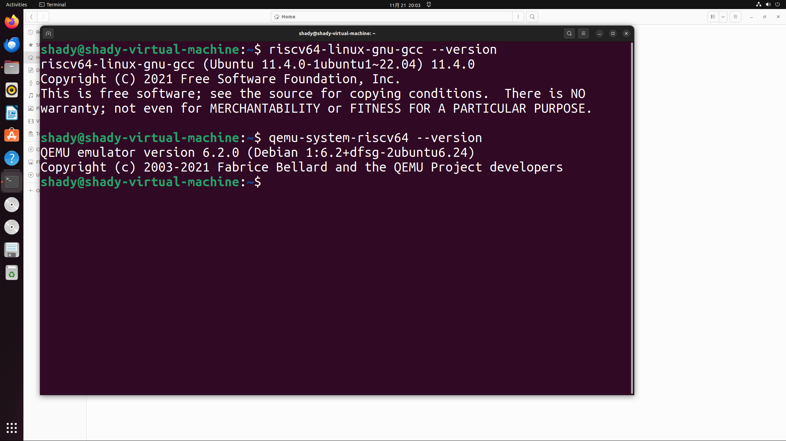
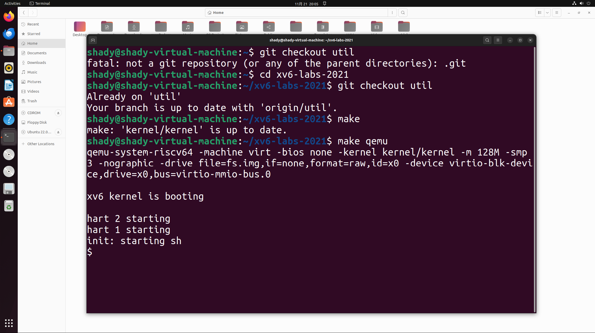
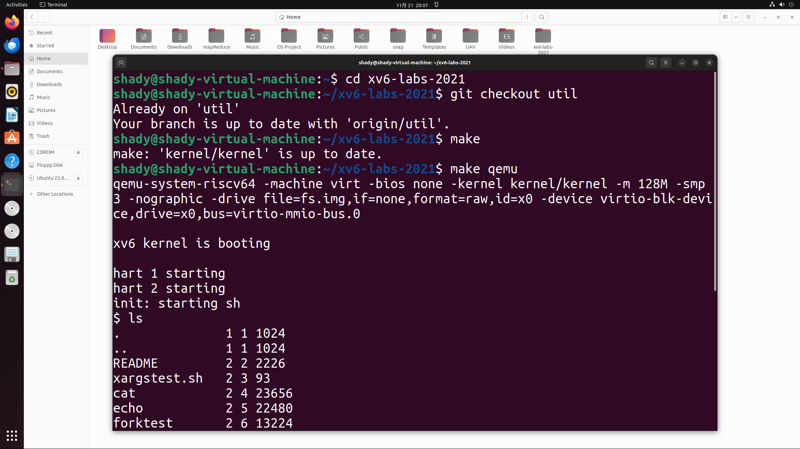
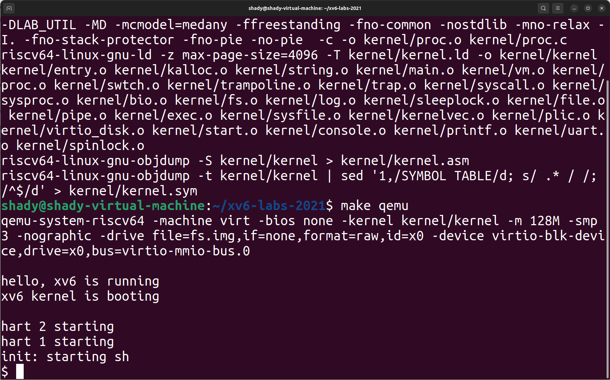
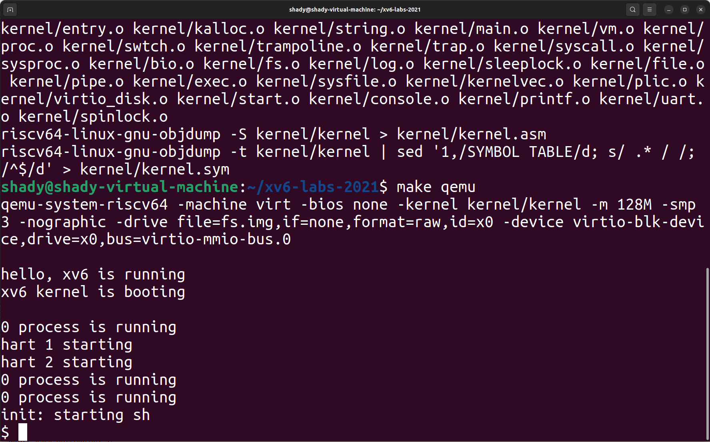
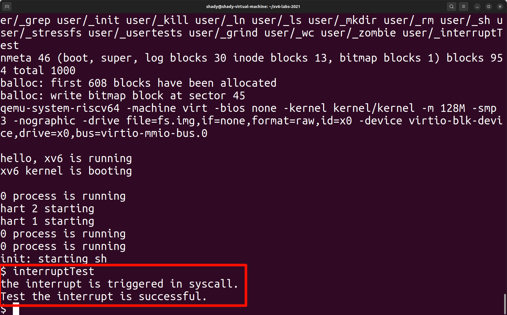

# 操作系统专题实践记录

### xv6系统环境配置

https://blog.csdn.net/weixin_52553215/article/details/130956910

#### 安装配置xv6系统

```bash
sudo apt install qemu-system-misc
```

```bash
sudo apt install gcc-riscv64-linux-gnu
```



#### 启动xv6系统

- 进入xv6系统编译启动

  ```bash
  cd xv6-labs-2021
  ```

  ```bash
  git checkout util
  ```

  ```bash
  make
  ```

  ```bash
  make qemu
  ```



- 启动后可通过命令查看（如下图使用 ls 命令查看）



----

### 初始化并输出hello

https://th0ar.gitbooks.io/xv6-chinese/content/content/chapter0.html

#### 1. `entry.S`

`entry.S` 是用汇编语言编写的启动引导代码，负责在系统上电或复位后进行最低级的硬件初始化。它首先设置处理器的堆栈指针（`sp` 寄存器）到一个预定义的内存位置，确保后续函数调用有一个有效的堆栈。接着，`entry.S` 配置 RISC-V 的异常向量表，以处理各种异常和中断。完成这些基本设置后，`entry.S` 将控制权转移到 C 语言编写的 `start` 函数（位于 `start.c`），开始进一步的内核初始化过程。

#### 2. `start.c`

`start.c` 定义了 `start` 函数，这是从汇编代码 (`entry.S`) 调用的第一个 C 语言函数。该函数负责执行一些基础的内核初始化工作，例如设置页表或其他必要的内存管理结构，以适应 RISC-V 架构的需求。完成这些初始化步骤后，`start` 函数调用内核的主函数 `main`（位于 `main.c`），启动内核的主要执行流程。`start.c` 充当了汇编启动代码与 C 语言内核代码之间的桥梁，确保内核环境准备就绪。

#### 3. `main.c`

`main.c` 包含了操作系统内核的主函数 `main`，这是内核的核心入口点。`main` 函数负责进一步的内核初始化，包括内存管理初始化、进程管理设置以及设备初始化（如 UART）。作为初始化测试的一部分，`main` 函数调用 `printf` 输出 "hello"，以验证系统初始化是否成功。除此之外，`main` 还可能包含内核的主循环或其他关键功能，确保操作系统能够正常运行和响应系统调用。

#### 4. `printf.c`

`printf.c` 实现了内核级的 `printf` 函数，提供格式化输出的功能，用于在内核中打印调试信息或其他文本。由于内核不依赖标准 C 库，`printf.c` 必须自行实现格式字符串的解析和可变参数的处理。该文件负责解析传入的格式字符串，识别和处理格式说明符（如 `%s`, `%d`），并将格式化后的字符通过 UART 发送到控制台。`printf.c` 的实现确保内核能够以可读的方式输出信息，辅助开发和调试。

#### 5. `riscv.h`

`riscv.h` 包含了与 RISC-V 架构相关的宏定义、寄存器地址和特权级别等信息。这些定义在整个内核代码中被广泛使用，确保代码的可移植性和可读性。文件中包括 CSR（控制状态寄存器）的访问宏，用于读取和写入 CSR，以及中断和异常处理的定义。此外，`riscv.h` 还定义了内存映射寄存器地址，如 UART 和定时器的基地址和偏移量，为内核与硬件交互提供了必要的低级接口。这些定义简化了内核代码中与硬件相关的操作。

#### 6. `uart.c`

`uart.c` 实现了与 UART（通用异步收发传输器）硬件的通信接口，负责串行输入输出操作。该文件包括 UART 的初始化函数 `uartinit`，用于配置波特率、数据位、停止位等参数，并启用发送和接收功能。`uart.c` 还实现了字符发送函数 `uartputc`，通过检查 UART 的发送缓冲区是否空闲，然后将字符写入数据寄存器发送到控制台。同样，字符接收函数 `uartgetc` 负责从 UART 数据寄存器读取接收到的字符。通过这些功能，`uart.c` 为内核提供了基本的串行通信能力，支持 `printf` 等输出功能以及可能的输入操作。

#### 输出hello

添加以下内容初始化并输出hello：

```c
    consoleinit();
    printfinit();
    printf("\n");
    printf("hello, xv6 is running\n");
    printf("xv6 kernel is booting\n");
    printf("\n");
```

#### 输出结果：



----

### xv6系统0号进程

#### 1. 进程表与系统初始化

`proc.c` 文件中包含一个固定大小的进程表，用于管理系统中的所有进程。每个进程表项包含进程的状态、PID、内存管理信息、上下文等关键数据结构。在系统启动时，`procinit` 函数负责初始化进程表中的所有进程结构体，将它们标记为`UNUSED`状态，并为每个进程分配一个内核栈。此外，还会初始化与进程管理相关的锁，如PID分配锁和等待锁，以确保在多核环境下的同步性。这一初始化过程确保了系统在启动时具备管理和调度多个进程的基本结构和机制。

#### 2. 调度器（Scheduler）的核心功能

调度器作为0号进程，运行在一个无限循环中，负责不断地扫描进程表，查找处于`RUNNABLE`状态的进程，并将CPU资源分配给这些进程。调度器通过遍历进程表，选择第一个处于`RUNNABLE`状态的进程，将其状态更改为`RUNNING`，并将其指针赋值给当前CPU的`c->proc`，表示该CPU正在运行该进程。随后，调度器通过上下文切换机制将控制权转移给选中的进程，使其开始执行。这一过程确保了系统中所有可运行的进程都能得到公平的CPU时间，从而实现多任务处理。

#### 3. 进程选择与切换

当调度器找到一个`RUNNABLE`进程后，会将其状态设置为`RUNNING`，并通过上下文切换将控制权转移给该进程。上下文切换涉及保存当前调度器的状态并加载被调度进程的状态，使得该进程能够继续执行其任务。当被调度的进程因系统调用、等待资源或时间片耗尽等原因放弃CPU时，控制权会返回调度器，调度器继续扫描并选择下一个可运行的进程。这种循环机制确保了系统中所有进程都能得到适当的执行机会，并且系统能够持续高效地运行。

#### 4. 系统空闲管理

当系统中没有其他`RUNNABLE`进程时，调度器作为0号进程会保持CPU处于活动状态，防止系统进入完全空闲状态。这种空闲处理机制确保了即使在负载较低或无用户进程运行时，系统资源仍然被合理管理和利用。通过充当空闲进程，调度器能够维持系统的活跃状态，避免资源浪费，同时为新进程的到来做好准备。

#### 5. 多核协调

在多核系统中，每个CPU核都有自己的调度器实例，负责管理该核上的进程调度。这种设计提高了系统的并行处理能力和整体性能。每个核独立运行其调度器，能够同时调度和执行多个进程，从而充分利用多核架构的优势，提升系统的吞吐量和响应速度。这种多核协调机制确保了系统在多处理器环境下依然能够高效稳定地运行。

#### 6. 系统稳定性与资源管理

调度器通过持续的进程调度和合理的资源分配，维护系统的稳定性，避免资源的死锁或浪费。它能够及时响应来自硬件或其他内核组件的中断和系统调用，确保系统能够快速适应变化的运行状态。通过有效的资源管理，调度器确保了系统资源被公平分配和高效利用，防止某些进程独占资源导致系统性能下降或不稳定。

#### 7. 进程创建与管理

`proc.c` 中的 `allocproc` 函数负责在进程表中分配一个新的进程结构，初始化其基本状态，如PID、内存页表、内核栈等，并将其标记为`RUNNABLE`状态，等待被调度执行。同时，`userinit` 函数创建并初始化系统中的第一个用户级进程（通常称为init进程），该进程负责启动用户空间的第一个程序，为后续的多用户、多任务环境奠定基础。这些机制确保了系统能够动态地创建和管理多个进程，支持多任务处理。

#### 8. 0号进程的角色与作用

基于上述功能，**0号进程**在 xv6 中主要扮演调度器的角色，负责管理和分配CPU资源，确保所有可运行的进程都能得到执行机会。作为系统的调度核心，调度器不仅负责进程的选择和上下文切换，还在系统空闲时维持CPU的活跃状态，避免资源浪费。在多核环境下，每个CPU核拥有独立的调度器实例，提升了系统的并行处理能力。此外，调度器通过合理的资源管理和及时的响应机制，维护了系统的整体稳定性和高效性。

#### 添加以下内容表明0号进程调用：

```c
void
scheduler(void)
{
  struct proc *p;
  struct cpu *c = mycpu();
  
  c->proc = 0;
  
  printf("0 process is running\n");
  
  for(;;){
    // Avoid deadlock by ensuring that devices can interrupt.
    intr_on();

    for(p = proc; p < &proc[NPROC]; p++) {
      acquire(&p->lock);
      if(p->state == RUNNABLE) {
        // Switch to chosen process.  It is the process's job
        // to release its lock and then reacquire it
        // before jumping back to us.
        p->state = RUNNING;
        c->proc = p;
        swtch(&c->context, &p->context);

        // Process is done running for now.
        // It should have changed its p->state before coming back.
        c->proc = 0;
      }
      release(&p->lock);
    }
  }
}
```

#### 输出结果：



----

### xv6系统中断处理

https://th0ar.gitbooks.io/xv6-chinese/content/content/chapter3.html

http://huibai.art/xv6/mit6-s081-%E7%AC%AC%E5%8D%81%E5%A4%A9%EF%BC%9Alab4_traps/

#### 中断处理的总体概述

中断（Interrupt）是由硬件设备或软件指令发出的信号，用于通知处理器有事件需要立即处理。中断可以分为硬件中断和软件中断两种类型。硬件中断由外部设备（如键盘、网络接口、定时器等）触发，用于通知CPU处理设备的请求；而软件中断则由软件指令（如系统调用）触发，用于请求操作系统提供特定的服务。xv6 的中断处理流程包括中断的触发、处理器响应中断、执行中断处理程序以及上下文恢复等关键步骤。

#### `trap.c` 的核心功能

`trap.c` 是 xv6 中负责处理中断和异常的主要 C 语言源文件。其核心职责包括定义和实现主陷阱处理函数，该函数在处理器进入内核模式后被调用。`trap.c` 的主要任务是识别中断的类型（如系统调用、硬件中断或异常），并根据中断类型调用相应的处理程序。例如，当用户进程通过 `ecall` 指令发起系统调用时，`trap.c` 会提取系统调用号和参数，调用对应的系统调用处理函数，并将结果返回给用户进程。此外，`trap.c` 还负责处理各种硬件中断，如定时器中断和I/O设备中断，确保设备请求能够被及时响应和处理。

#### `trampoline.S` 的核心功能

`trampoline.S` 是 xv6 中的一个汇编语言源文件，负责在用户态和内核态之间进行安全、高效的上下文切换。该文件定义了一个称为“trampoline”的代码段，位于高地址空间，用于从用户态切换到内核态，并在处理中断或系统调用后返回用户态。`trampoline.S` 的主要职责是保存当前用户进程的寄存器状态（如程序计数器和堆栈指针），确保在切换到内核态时能够正确恢复这些状态。此外，`trampoline.S` 还调用 `trap.c` 中的陷阱处理函数，确保中断处理逻辑在内核空间安全执行。

#### `kernelvec.S` 的核心功能

`kernelvec.S` 是另一个汇编语言源文件，负责设置内核级的中断向量表（Interrupt Vector Table），定义各种中断类型对应的处理入口。该文件通过定义不同中断类型的处理入口，确保当中断发生时，处理器能够跳转到正确的处理代码。例如，系统调用、硬件定时器中断和设备中断等都有各自的处理入口。`kernelvec.S` 中的汇编代码负责保存当前的上下文状态，并调用 `trampoline.S` 中的代码，实现从用户态到内核态的安全过渡。

#### 中断处理流程的详细步骤

结合上述三个源代码文件，xv6 的中断处理流程可以分为以下几个详细步骤。首先，当外部设备或用户进程发起中断信号时，处理器会根据中断类型从中断向量表中查找对应的处理入口，这些入口由 `kernelvec.S` 定义。处理器随后进入内核态，`trampoline.S` 负责保存当前进程的上下文并调用 `trap.c` 中的陷阱处理函数。`trap.c` 根据中断类型执行具体的处理逻辑，如系统调用处理或设备中断处理。处理中断后，`trap.c` 通过 `trampoline.S` 恢复被中断进程的上下文，并切换回用户态，使进程能够从中断点继续执行。这一流程确保了中断能够被高效、可靠地处理，并且系统能够稳定运行。

#### 中断处理中的关键数据结构

在 xv6 的中断处理过程中，两个关键的数据结构是陷阱帧（Trap Frame）和上下文（Context）。陷阱帧用于保存被中断进程的寄存器状态、程序计数器（PC）和堆栈指针（SP）等信息，确保在中断处理完成后能够准确恢复进程的执行状态。上下文则用于保存和恢复进程的执行环境，包括寄存器和堆栈指针，支持多任务处理中的上下文切换。通过这两个数据结构，xv6 能够在处理中断时保持进程状态的一致性和完整性，确保系统能够无缝地从中断中恢复。

#### 中断处理中的锁机制

为了确保在多核系统中对共享资源（如进程表和设备驱动程序）的安全访问，xv6 在中断处理过程中使用了多种锁机制。自旋锁（Spinlock）是主要的锁机制，用于保护共享数据结构，防止多个CPU同时访问导致的数据竞争。在处理中断时，内核会获取相应的锁，确保对共享资源的独占访问。例如，修改进程表时需要持有锁，以避免并发修改引发的数据不一致性。锁的获取与释放机制确保了数据的一致性和系统的稳定性，防止在处理中断时出现数据竞争或死锁的情况。

#### 异常与错误处理

在中断处理过程中，xv6 设计了异常与错误处理机制，以应对各种潜在的异常情况。`trap.c` 中的陷阱处理函数会检测中断的来源和类型，识别非法操作、未处理的中断类型或其他异常情况。对于无法处理的异常，操作系统会调用内核的 `panic` 函数，终止系统运行并输出错误信息，帮助开发者在调试过程中定位和修复问题。这样，xv6 能够在面对异常和错误时保持系统的稳定性和安全性，避免系统进入不可预测的状态。

#### 中断返回与上下文恢复

处理中断或异常后，系统需要将控制权恢复到被中断的进程，确保其能够从中断点继续执行。`trampoline.S` 负责保存被中断进程的寄存器状态，并在中断处理完成后恢复这些状态。这样，进程能够准确地从中断点继续执行，不受中断处理的影响。同时，`trampoline.S` 将处理器模式从内核模式切换回用户模式，恢复用户进程的执行。这包括恢复程序计数器（PC）和堆栈指针（SP），确保进程能够无缝地继续执行其任务，从而实现系统的连续性和稳定性。

#### 新增中断并通过新建用户函数进行测试中断

###### kernel/kernelvec.S末尾新增：

```c
.globl vector100
vector100:
        addi sp,sp,-16
        sd ra, 8(sp)
        sd a0, 0(sp)
        mv a0, sp
        call kerneltrap
        ld a0, 0(sp)
        ld ra, 8(sp)
        addi sp, sp, 16
        sret
```

###### kernel/trap.c中68行新增：

```c
void
usertrap(void)
{
  int which_dev = 0;

  if((r_sstatus() & SSTATUS_SPP) != 0)
    panic("usertrap: not from user mode");

  // send interrupts and exceptions to kerneltrap(),
  // since we're now in the kernel.
  w_stvec((uint64)kernelvec);

  struct proc *p = myproc();
  
  // save user program counter.
  p->trapframe->epc = r_sepc();
  
  if(r_scause() == 8){
    // system call

    if(p->killed)
      exit(-1);

    // sepc points to the ecall instruction,
    // but we want to return to the next instruction.
    p->trapframe->epc += 4;

    // an interrupt will change sstatus &c registers,
    // so don't enable until done with those registers.
    intr_on();

    syscall();
  } else if(r_scause() == 100){
    printf("the 100 scause interrupt triggered!");
  } else if((which_dev = devintr()) != 0){
    // ok
  } else {
    printf("usertrap(): unexpected scause %p pid=%d\n", r_scause(), p->pid);
    printf("            sepc=%p stval=%p\n", r_sepc(), r_stval());
    p->killed = 1;
  }

  if(p->killed)
    exit(-1);

  // give up the CPU if this is a timer interrupt.
  if(which_dev == 2)
    yield();

  usertrapret();
}
```

###### kernel/trap.c中32行新增：

```c
void
interrupt_handler(){
  printf("the interrupt triggered!");
}
```

###### kernel/trap.c中152行新增：

```c
  if(scause == 100){
    printf("the interrupt triggered!");
  }
```

###### kernel/syscall.c文件新增：

```c
void
syscall(void)
{
  int num;
  struct proc *p = myproc();

  num = p->trapframe->a7;
  if (num == 100) {
    printf("the interrupt is triggered in syscall.\n");
    return;
  }
  if(num > 0 && num < NELEM(syscalls) && syscalls[num]) {
    p->trapframe->a0 = syscalls[num]();
  } else {
    printf("%d %s: unknown sys call %d\n",
            p->pid, p->name, num);
    p->trapframe->a0 = -1;
  }
}
```

###### user/user.h顶部新增：

```c
typedef unsigned int   uint;
```

###### 新增文件user/interrupt_test.c：

```C
#include "user.h"
int main(void) {
    asm volatile("li a7, 100; ecall"); 
    printf("Test the interrupt is successful.\n");
    exit(0);
}
```

###### makefile文件196行新增：

```c
UPROGS=\
	$U/_cat\
	$U/_echo\
	$U/_forktest\
	$U/_grep\
	$U/_init\
	$U/_kill\
	$U/_ln\
	$U/_ls\
	$U/_mkdir\
	$U/_rm\
	$U/_sh\
	$U/_stressfs\
	$U/_usertests\
	$U/_grind\
	$U/_wc\
	$U/_zombie\
	$U/_interruptTest\
```

###### 编译运行命令 `make` 、 `make qemu`

###### 执行测试文件 `interruptTest`

#### 输出结果


